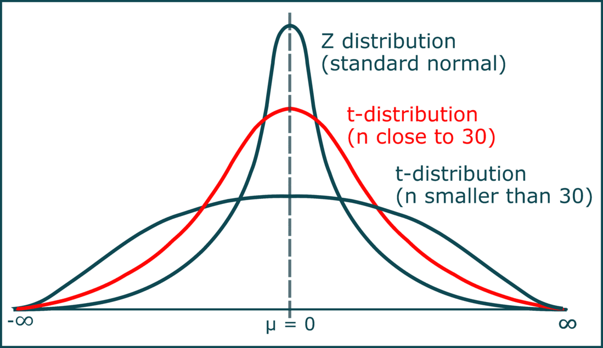
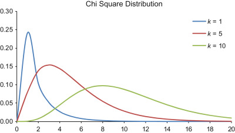

# Week 2 - Probability

# The Normal Distribution (Intro, Standard Normal)

Approximating a distribution of a continuous variable X

- when talking about the normal distribution we’re talking about anything we can measure
- we take a *sample* to find out more about the *underlying population*
    - $\bar{X}$ = sample mean
    - $\mu$ = population mean
    - $S^2$ = sample variance (sqrt for std. dev)
    - $\sigma^2$ = population variance (sqrt for std. dev)
    - if we observe 60 cars per min in the sample, we can infer 60 cars per min for the population
- descriptive stats describes sample, inferential stats estimates population params
- Distributions to know: Normal, T, Chi-square, F, Geometric (Bernoulli), Binomial
- normal is perhaps most important since most phenomena follow this distribution
    - $X \sim N(\mu, \sigma)$ - normal distributions are defined by two population parameters (mean, and standard deviation)
        - We can say for example, X (peoples’ height) comes from some *******process******* that is given by a normal distribution with mean of 60 and standard deviation of 5
- A standard normal distribution has mean of 0 and standard deviation of 1
    - oftentimes, will want to convert a distribution to standard normal
- For any distribution of variable X, raw scores can be converted to ****************standardized scores**************** (aka **************Z score**************) using the formula:
    - $Z=\frac{X-\mu}{\sigma}$ (subtract mean, divide by standard deviation)

# The Normal Distribution (Z-Scores)

To compute z-scores:

- calculate z-score of a column:
    - `okc <- okc %>% mutate(height_z = (height - mean(height, na.rm=T))/sd(height, na.rm=T))`
    - if a z-score = 1.70 this mean that that person is 1.70 standard deviations taller than average
        - pos z-score means above the mean, neg means below the mean
- essentially they tell you the magnitude of original score relative to the average
- shorter way to calculate z-scores in for a column of observations in R:
    - `scale(df$column)`
- Scaling ************shifts************ and ************scales************ the distribution
- If you just subtract the mean without dividing by standard deviation (centering)
    - this tells you number of ****************original**************** units above or below the mean (not standard deviations)
    

# The Normal Distribution (Areas, Probabilities)

To find probabilities that a score X falls in a certain range

- Given a normal distribution (can be approximated) can calculate probability of finding an observation at a given z-value
- Ex: what is the probability an OkCupid user has height of < 65”?
    - X = 65 —> Z = -0.849 —> `pnorm(-0.846)` = 0.1987764
        - 0.1987764 is the area under the curve for height **<** 65”
    - What can be said:
        - about 20% of OkCupid users have height < 65”
        - probability that any OkCupid user has height < 65” is about 20%
- `pnorm` function gives area to ************left************, so if you want area to the ***************right******* then take 1 - `pnorm`
    - in R, you can set `lower.tail=F` in `pnorm`

- Going the other direction, you can get the z-value corresponding to a given percentile
    - $P(X<Z) = 0.80$ (what is z-value corresponding to 80th percentile?)
    - given by `qnorm` function in R
- If someone scored in the 99th percentile on a test their z-score = `qnorm(.99)` = 2.32

# The Normal Distribution (Sampling Distribution of the Mean)

To approximate the sampling distribution of the mean

- Z-test is most basic type of statistical hypothesis test
    - asks: is the mean of our population = to hypothesized mean?
    - null hypothesis: means are equal
    - alternative hypothesis: means are not equal
- 3 steps to Z-test
    1. Assume null hypothesis
    2. Examine distribution of means that would be observed if sample mean taken from population
        1. called sampling distribution of the mean (depends on mean, std dev, and sample sizes)
            1. create normal distribution of means 
            - expect sample mean to accurately reflect population mean
                - $\mu_{\bar{x}} = \mu,$
            - and standard error goes down as *n* (sample size) goes up
                - $\sigma_{\bar{x}} = \frac{\sigma}{\sqrt{n}}$
    3. Figure out how unlikely it would be to observe the mean under null hypothesis
        1. convert observation to Z value, assuming the population standard error is known
        2. standard error = standard deviation / sample size
- 2-sided p-value calculation: `2*(1-pnorm(abs(144)))` where 144 is the observed Z-score
    - since p < 0.001 can say avg height of OkCupid users in data set is different than population mean of 66”
- ******************************Central Limit Theorem******************************:
    - Regardless of the actual distribution of population mean ($X$), the sampling ************distribution************ of the mean of  $X$, ($\bar{X}$), will approach a normal distribution for large N
- If sample size is small, there are certain statistical tests that you can’t do, like parametric tests
- How large is large (enough for Z-test)?
    - small deviations from normality, N > 25
    - large deviations from normality, in the hundreds

# The Normal Distribution (Assessing Normality)

How do we know if a variable is normally distributed?

- skewness: extent to which a distribution is symmetric
    - > 1 skewness reflects considerate departure from normality
- kurtosis: extent to which a distribution is peaked vs flat
    - > 3 kurtosis reflects considerate departure from normality
- `df %>% select(col1, col2) %>% describe()`
- QQ Plot
    - order X vals from small to large
    - plot X obs against value of standard normal random variable
    - see if QQ plot follows straight line
    - in practice, the tails usually show some departure from straight line
- many parametric statistical tests rely on sampling distribution of mean being normal

# Other Distributions

| T-distribution | - sampling distribution of mean when population standard deviation is unknown
- analog of Z distribution when don’t know the population standard deviation
- regression parameters |
| --- | --- |
| Chi-square | - sum of squared normal distributions
- test statistic for contingency tables
- test statistic for maximum likelihood estimates |
| F-distribution | - ratio of chi-square variables |
| Bernoulli | - proportion of successful trials |

t-distribution

- symmetric, unimodal
- shape depends on degrees of freedom
    - normal distribution is, in theory, when the t-distribution has infinite degrees of freedom
    - the lower the degrees of freedom, the flatter the distribution
- used to test whether sample mean is = to hypothesized value of $\mu_{0}$ **(one-sample t-test)**
    - $T = \frac{\bar{X}-\mu_0}{s/\sqrt{N}}$, where s = sample standard deviation
    - df = N - 1 for one-sample t-test
- used to test whether mean of two groups is equal **(two-sample t-test)**
    - df = n1 + n2 - 2 for 2-sample t-test
- Use R to find 2-sided p-value corresponding to $t_{10} = 2.25$, df = 10
    - `2*(1-pt(2.25, df=10))` = .04818
    - or, `pt(2.25, df=10, lower.tail=F)*2`
        - `pt(2.25, df=10)` gives area to ****left,**** so 1 - that area is area to the right
            - multiply by two for a 2-sided p-value
- Use R to find t value corresponding to 2-sided p-value of 0.05, df = 8
    - `qt(0.05/2, df=8)` = -2.306004 — could be neg or pos since it is 2-sided
    - 2-sided p-value of 0.05 on each side means 0.025 area to left and 0.025 area to the right
- note: in the R functions, p stands for p-value and q stands for quantile

chi-square distribution ($\chi^2$)

- non-symmetric, ranges from 0 to pos infinity
- as degrees of freedom (df) k increases, the chi-square distribution becomes more symmetric
    - when df is sufficiently large, the chi-squared distribution can be approximated by normal distribution using central limit theorem
- chi-square distribution with df=1 is equivalent to $Z^2$
- chi-square distribution with k df is equivalent to sum of squares of k independent standard normal distribution squared
    - if you square a set of standard normal random variables and sum up the results, the distribution of this sum follows a chi-squared distribution.
- chi-square tests are always non-directional (always use the area on the right side)
- Use R to find p-value corresponding to $\chi^2_{10} = 5.25$
    - `pchisq(q=5.25, df=10, lower.tail=F)` = 0.83738643
- Use R to find chi-squared value corresponding to p-value of 0.05 on 8 degrees of freedom
    - `qchisq(p=1-.05, df=8)` = 15.50731
- the `chisq` functions in R always gives are on the left-handed tail, so make sure to subtract 1 or use `lower.tail` parameter

F distribution

- like chi-squared it is non-symmetric and ranges from 0 to pos infinity
- typically used for ANOVA tests
    - arises when comparing variances or ratios of variances
- but now, there is a numerator degrees of freedom (df) and denominator df
    - the two dfs come from ratio of two independent chi-squared distributions divided by their respective degrees of freedom
    - $d_1$ corresponds to variability in sample or group you are testing
        - for ex, in an ANOVA test, $d_1$ = df associated with treatment (group) variability
    - $d_2$ corresponds to variability of another sample or group
        - often referred to as “error” or “residual” variability
        - in the above example, $d_2$ = df associated with variability not accounted for by the treatment effects
- Used to compare variability between two groups or sources of variability
    - compare variance between different groups (treatment) between variance within the groups (error)
- F-tests are also non-directional (always use area on right to compute p-values)
- Find p-value corresponding to $F_{10,1} = 2.25$
    - `pf(q=2.25, df1=10, df2=1, lower.tail=F)` = 0.4799306
- Find F-value corresponding to p-value of 0.05 (on 10 numerator and 1 denominator df)
    - `qf(p=.05, df1=10, df2=1, lower.tail=F)` = 241.8817

Bernoulli distribution

- a discrete distribution
- used to describe probability of dichotomous (binary) outcome
- $P(X = 1) = p = 1 = 1 - q$
    - probability X =1 (instead of 0) is p, where p is the probability the event happens
    - q is the probability p does not happen and is equal to 1 - p
- $Var(X)=pq$
    - variance of binary outcome is probability of it happening times probability that it doesn’t happen
- for what value of p is variance highest?
    - if p = 1, then Var(X) = 0 (lowest)
    - if p = .5, then Var(X) = .025 (highest)

Binomial Distribution

- describes probability of # of successes (k) in # of trials (n)
- $P(Y=k)=\binom{n}{k}p^k(1-p)^{n-k}$
    - $\binom{n}{k}=\frac{n!}{k!(n-k)!}$
    - Lets say you observe Y = 2 heads from flipping a coin on three trials (n), what is the probability you observe Y = k = 2?
    - $P(Y=2)=\binom{3}{2}.5^2(1-.5)^{3-2}=\frac{3*2*1}{(2*1)(1)}(.25)(.5) = .375$
- Bernoulli distribution = binomial distribution when n = 1
- When n —> infinity, binomial distribution begins to look more like normal distribution
