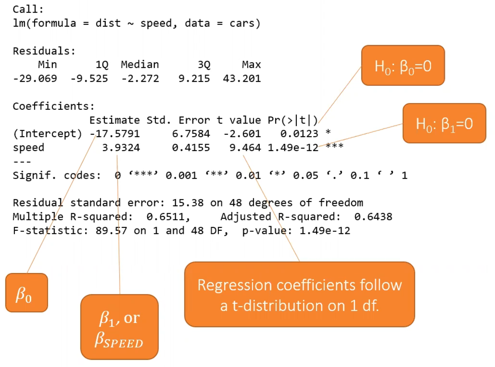
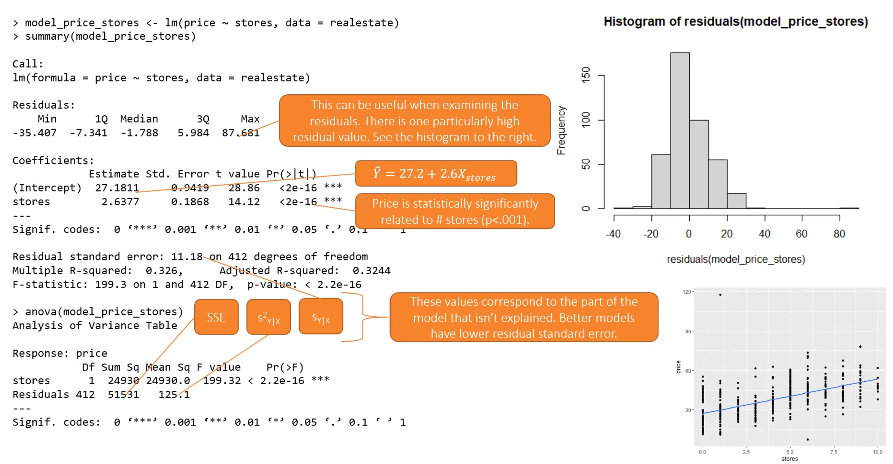

# Week 3 - Regression I

# Intro to Linear Regression

- Lots of statistical tools such as ANOVA and t-tests are just special cases of regression
- All about association between two variables: X and Y
    - Goal is to build a model for Y as a function of X
- First step = determine model form (how is Y related to X?)
- Regression line formula variations:
    - $Y = \alpha + \beta X$
    - $Y = \beta_0 + \beta_1X$
    - $Y=mx+b$
- $a$ = y-intercept (value of y when x=0)
- $\beta$ = slope (how much y increases when x increases by 1 unit)
- There will always be some error associated with predicted values, so the equation becomes:
    - $Y = \beta_0 + \beta_1X + e_i$
    - $e_i$ is the “residual” (part of Y that is not explained by the regression line/model)
- Equation for ******************predicted****************** value of Y:
    - $\hat{Y} = \beta_0 + \beta_1X$

- Running linear regression in R:
    - `lm(dist ~ speed, data = cars) %>% summary()`
    - output:

- The `Estimate` column gives the actual estimated beta values
- `Std. Error` gives the standard associated with the coefficients in `Estimate`
- In the `Pr(>|t|)` column, the p-values are associated with the statistical tests where the null hypothesis is that the coefficient/beta value = 0 and alternative hypothesis is that the coefficient/beta value ≠ 0
- The equation describing relationship between stopping distance and speed:
    - $\hat{Y} = -17.58 + 3.93X$
- Is stopping distance related to speed?
    - Yes, using the second row in the `Pr(>|t|)` column (which is the test that tests whether the slope of the line is equal to 0) is statistically significant
    - When slope = 0, a flat line is being modeled, which means there is no relationship
- Predicted stopping distance for a car that isn’t moving is -17.58

- Important: we can only reasonably predict Y values across range of X under study
    - relationship may be nonlinear or different for X values not under study

# Transformations of Y

- If Y and X don’t exhibit a linear relationship:
    1. Perform nonlinear regression
        1. useful if the form of the model is known offhand
        2. can be difficult
    2. Perform linear regression and adjust the model/data to make it fit
        1. useful when departure from linearity is not too extreme
            1. looking at X vs f(Y)
- Tukey’s Ladder of Transformations
    - Find $\lambda$ value to make relationship between X and $Y^\lambda$ linear
    - values for $\lambda$: -2, -1, 0, 1/2, 1, 2, 3
    - corresponding $Y^\lambda$ values: $\frac{1}{y^2}$, $\frac{1}{y}$, $log(y)$, $y$, $y^2$, $y^3$
    - when lambda < 1: this is reducing (pulling right tail of positively skewed distribution)
    - when lambda > 1: this is expanding (pulling in left tail of negatively skewed distribution)
- Box-Cox Transformation determines best value for lambda using log-likelihood
    - look for peak of plot
- Model becomes more complex to interpret with transformations

# LINE Assumptions

- 4 assumptions of ************LINEar************ regression:
    1. Linearity
    2. Independence
    3. Normality
    4. Equality of variances (”homoscedasticity”)

- Linearity:
    - if relationship between X and Y is truly linear, then:
        - $\mu_{Y|X} = \beta_0 + \beta_1X$
        - the mean of Y conditional on X is given by the regression line
        - in other words, for any value of X, the regression line goes through the mean of Y values (at that X value)
- Independence:
    - comes down more to research design
    - conditional on X, the Y-values should be statistically independent of each other
        - error terms should be independent of one another
    - Which are independent?
        - Chart review of comorbidities of patients who were undergoing COVID treatment at a hospital — Yes
        - Study on visual activity where individual’s visual activity was measured in left and right eyes — No, right eye for one patient likely to be a lot more similar to their left eye than someone else’s eyes
        - Height of children measured each year for 5 years (longitudinally) — No, children going to be more similar to their own height in previous year than to others
        - BMI of children and their guardian assessed in study on physical activity — No, children are likely to be more similar to their own parents than to others
        - Study on GDP of several countries and population’s collective attitude toward certain policies
    - lack of independence can be accounted for in more complex regression models (GEE, mixed-effect models, etc.)
- Normality
    - for any particular value of X, Y has a normal distribution
    - the outcome doesn’t necessarily have to be normally distributed
    - often examined by looking at residuals (are the residuals normally distributed?)
    - remember Central Limit Theorem: larger sample sizes means inferences will be more robust to deviations from assumption
- Equal Variance
    - for any value of X, the variance of Y is constant
    - variance of the outcome should not depend on which X values you’re looking at

- normality and homoscedasticity assumptions are equivalent to saying:
    - $e \sim N(0, \sigma^2)$
    - residuals should be distributed with mean 0 and constant variance across range of X
- linear model only valid if the assumptions hold

# Best Fit Line

- There are multiple ways to find the best fitting line to data
    - For the course, the different approaches will give same results, but will result in different results for more complicated modeling approaches
- Ordinary Least Squares (OLS)
    - Finds the line that minimized the sum of squares of residuals
    - Values of $\hat{\beta_0}$ and $\hat{\beta_1}$ are called the least squares estimates if minimizing square of residuals is used
    - $\sum_{i=1}^{N}[Y_i - (\hat{\beta_0}+\hat{\beta_1})]^2 = \sum_{i=1}^{N}e_i^2$
- Minimum Variance
    - Find best linear unbiased estimators (BLUE) of $\hat{\beta_0}$ and $\hat{\beta_1}$ that are the “best” due to having minimum variance of all unbiased estimators
        - When looking at ***all*** unbiased estimators, the “best” ones have minimum variance
        - Finding estimates of intercept and slope that we are most certain of because they have the smallest variance
    - Gauss-Markov theorem: this definition will give rise to same least-squares estimators
- Maximum Likelihood
    - Find beta values that maximize the likelihood of the observed data occurring
        - same as least-squares estimators in linear regression context

# Interpreting LM Output

- `model <- lm(price ~ stores, data = realestate)`
- `summary(model)`

- Recall the line assumptions, look for a distribution with a mean of zero for the `Residuals` output
- Look at the residual standard error (SE for distribution of residuals)
- another useful tool: `anova(model)`
    - partitions effects from model into things that can be explained by the model
        - shows variance in outcome that can be explained by the model (`stores` row)
    - and variance in outcome that can’t be explained by the model (`Residuals` row)
        - The value under the `Sum Sq` is the value minimized in determining betas
    - `Pr(>F)` column tells you whether the model overall has some kind of explanatory or predictive power
        - will be equivalent to p-value associated with x-variable
- to determine if the intercept is interpretable:
    - does the predicted value of Y for X = 0 make sense?
    - sometimes X = 0 person cannot exist, or 0 is out of range of X values
- to make intercept more interpretable, you can center the X variable on its mean:
    - $\mu_{Y|X} = \beta_0 + \beta_1(X-\bar{X})$
        - fit the model on X values for which the mean of the X values has been subtracted
    - with this, then the intercept will represent the predicted Y value for when an observation’s X is equal to the mean of X
        - $X-\bar{X} = 0$ —> $X = \bar{X}$
        - an example: the mean BMI for individuals who get the mean hours of sleep is 22.45
        - intercept = mean value of y
    - when centering the X variable:
        - the intercept is the only thing that changes,
        - slope, SSE, and F-statistic doesn’t change

# Hypothesis Testing of Parameters

- Null hypothesis for slope: no correlation/association between X and Y
    - says: “best prediction is to predict the mean Y value for everyone”
    - failing to reject implies flat line does a good a job as any
        - though, there could still be a nonlinear relationship
- How to test the null hypothesis that the slope = 0? — Wald test
    - $t = \frac{\hat{\beta_1}}{se(\hat{\beta_1})}$ on N-2 df where
        - slope parameter divided by standard error of slope parameter
    - $se(\hat{\beta_1}) = \frac{S_{Y|X}}{S_X\sqrt{n-1}}$
        - standard deviation of the residuals divided by the standard deviation of X times sample size minus one
- How to test the null hypothesis that the intercept = 0
    - $t = \frac{\hat{\beta_0}}{se(\hat{\beta_0})}$
    - $se(\hat{\beta_0}) = {S_{Y|X}}{\sqrt{\frac{1}{n}+\frac{\bar{X}^2}{(n-1)S_X^2}}}$
        - standard deviation of residuals times 1 over n plus mean of whatever variable multiplies $\beta$ (could be mean of X, or mean of centered values of X), divided by variance of X
- Confidence interval for parameter:
    - $(1-\alpha)$% CI =
        - $\hat{\beta} \pm t_{(n-2,1-\frac{\alpha}{2})}se(\hat{\beta})$
- A confidence interval for a regression line shows where would you know some reasonable values for the line could also be
    - parameter of interest is $\hat{\mu}_{Y|X_0}$ — mean value of Y for a given value
        - $\hat{\mu_{Y|X_0}} \pm t_{(n-2,1-\frac{\alpha}{2})}se(\hat{\mu_{Y|X_0}})$, where
        - $se(\hat{\mu_{Y|X_0}}) = {S_{Y|X}}{\sqrt{\frac{1}{n}+\frac{(X_0 - \bar{X})^2}{(n-1)S_X^2}}}$
- A prediction interval is the interval in which we would expect most values to be
    - actual data isn’t on the line, there are lots of data points off of the line
    - parameter of interest is $Y_{X_{0}}$ — value of Y for a given value of X
    - innately wider than the CI for the line, will be more uncertainty in predicting a certain point than the mean
        - $Y_{X_{0}} \pm t_{(n-2,1-\frac{\alpha}{2})}se(\hat{Y}_{X_{0}})$
        - $se(\hat{Y}_{X_{0}}) = {S_{Y|X}}{\sqrt{1+\frac{1}{n}+\frac{(X_0 - \bar{X})^2}{(n-1)S_X^2}}}$
- to calculate in R: `confint(model_bmi_hoursc)`
- Typically, “confidence interval” used for the line (mean), and “prediction interval” used for points
    - `predict(model_bmi_hoursc, sleep, interval="confidence") %>% head()`
    - `predict(model_bmi_hoursc, sleep, interval="prediction") %>% head()`

# Correlation

- Correlation coefficient: how strongly two variables are related
- Regression coefficient: the nature of how two variables are related
- Pearson correlation coefficient, R, has standard meaning (no units)
    - can only detect linear relationships
- `with(data, cor.test(col1, col2, method="pearson"))`
- R = covariance between X and Y, scaled by the standard deviation of X times standard deviation of Y
    - $R = \frac{\sum_{i=1}^{n}(X_i-\bar{X})(Y_i-\bar{Y})}{\sqrt{\sum_{i=1}^{n}(X_i-\bar{X})^2\sum_{i=1}^{n}(Y_i-\bar{Y})^2}} = \frac{Cov(X,Y)}{S_XS_Y}$
- Hypothesis testing for $\rho$ (population correlation):
    - $t = \frac{R}{se(R)} = \frac{R\sqrt{N-2}}{\sqrt{1-R^2}}$, with t-distribution with N-2 df
    - Null hypothesis: population correlation is equal to 0
- Hypothesis test for correlation coefficient and the regression slope are equivalent (for simple regression)
    - Related via: $R = \frac{S_x}{S_y}\hat{\beta}$, where R = correlation coefficient and beta = slope, S = standard deviation
- Correlation coefficient can’t be relied on if the relationship between X and Y is not linear
    - you can either transform X or Y, or use a non-parametric test
- Non-parametric version of correlation is spearman’s R ($R_S)$
    - detects monotonic relationship between X and Y
        - monotonic refers to one way (always increasing or always decreasing)
    - Pearson’s R has more power than Spearman’s R if relationship is truly linear
    - essentially converts X and Y to ranks from low to high
