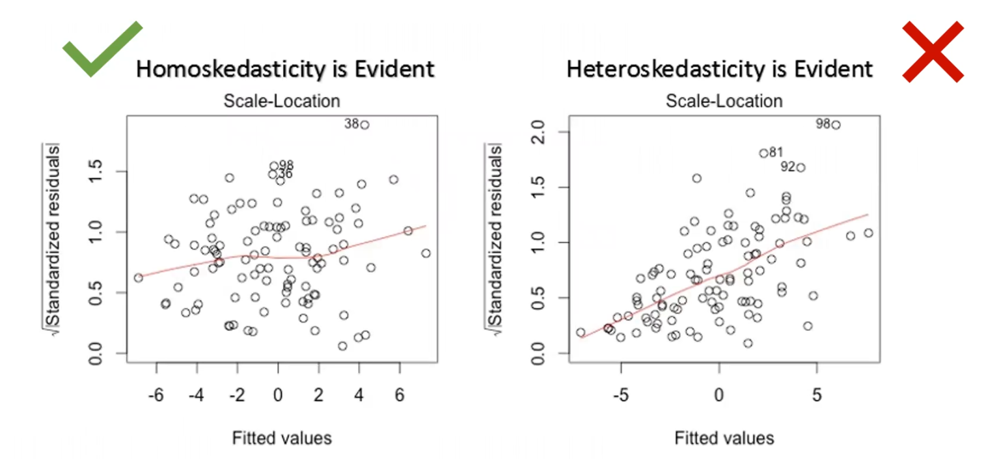
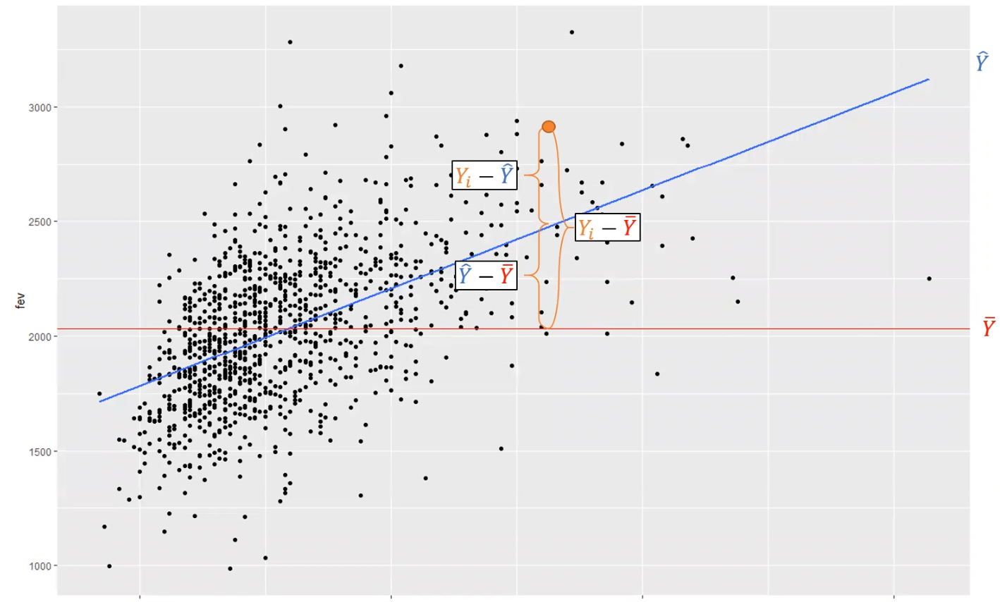

# Week 4 - Regression II

# Checking LINE Assumptions

- Remember the assumptions:
    - ******************Linearity******************. Scatter plots should indicate some degree of linearity. If there is nonlinearity, you may be able to transform the variables
    - ****Independence.**** You must assume this based on study design
    - ********************Normality.******************** The residuals should be normally distributed
    - ********Equal Variance (Homoscedasticity).******** Do the residuals have a common variance across the x values?
- Linearity
    - if relationship is linear, residual plot (predicted on X axis, residual on Y axis), should show flat scatter around 0 when plotted by predicted value of Y
        - look for no evident pattern
    - you can add a LOWESS (locally-weighted scatterplot smoother) line of the relationship
- Normality
    - examining residual statistics:
    - `carstot_model1 %>% select(resid) %>% psych::describe()`
        - does mean generally equal median?
        - is skew close to 0?
        - is kurtosis close to 0?
    - `shapiro.test(carstoot_model1$resid)`
    - plot histogram, QQ plot
    - remember when number of observations gets into the hundreds, CLT will make inference robust to non normality of residuals
    - General Guidelines:
        - Are mean and median within 20% of 1 SD?
        - Are skewness and kurtosis < |1|?
        - Does histogram of residuals look normal?
        - Does QQ plot follow a straight line?
        - Is Shapiro-Wilk test not rejected?
- Homoscedasticity
    - What is the variance of residuals across all values of X? Is it more or less consistent?
    - Plot residual vs X.
    - Plot residual vs predicted value (more evident in multiple regression)
    - Plot of square root of standardized residual vs predicted value
    - All methods will produce similar results
    
    
    

- Plotting graphs for assumptions
    - run `plot()` on a `lm` object to plot model diagnostics
- What to do when assumptions are violated?
    - change variables
        - convert variables to categorical
        - transform outcome or predictor variables
    - examine predictors (may be omitting important predictors) — more relevant in multiple regression
    - change modeling approach (logistic, Poisson, etc.)

# The ANOVA Table

- Important because it tell how “good” a regression model is
- Decomposes each Y value into:
    - part explained by regression model (predicted value)
    - part not explained by the regression model (residuals)
- Example: Children’s Health Study:
    - there is a lot of variation in FEV (forced expiratory volume)
    - FEV ranges from approximately 1000 to 3000 with a mean of 2031
    - need to be able to explain ***why*** do children’s FEV vary; who do we see variation in this outcome
        - is the variation random?
        - does some X variable contribute to the variation?
- A naive (null, unconditional) model would use the overall mean to predict FEV:
    - `lm(fev ~ 1, data = chs) %>% summary()`
        - intercept only model
- The error (residual) would be each persons Y value vs the mean
- The ANOVA table will tell us the sum of squares of the residuals
    - `lm(fev ~ 1, data = chs) %>% anova()`
        - in the output the `Sum Sq` column reflects the amount of variation in our Y values that is unexplained (total amount not explained in our model)
- Next, try looking at an independent variable to explain FEV, for example: weight
    - `lm(fev ~ weight, data = chs) %>% summary()`
- Now, ANOVA table broken into 2 components:
    - `lm(fev ~ weight, data = chs) %>% anova()`
    - sum of squares that is explained from the regression line (weight row)
    - sum of squares that is unexplained (Residuals row)
    - if a large enough proportion of the variance in FEV is explained by the regression, the F-test will be significant
    - $SS_{Total} = SS_{Reg} + SS_{Error}$
        - $SS_{Total} = \sum_{i=1}^{N}(Y_i-\bar{Y})^2$
        - $SS_{Reg} = \sum_{i=1}^{N}(\hat{Y}-\bar{Y})^2$
        - $SS_{Error} = \sum_{i=1}^{N}(Y_i-\hat{Y})^2$
            - $Y_i$ = observed, $\bar{Y}$= mean, $\hat{Y}$= predicted
    

    

- Recall, $R^2$ is “the proportion of variation in Y that is explained by our X variables”
    - $R^2 = \frac{SS_{Reg}}{SS_{Total}}$
- `Mean.Sq` column in ANOVA table is SS/df
    - gives unbiased estimate of the errors (not same as variance of residuals)
    - Mean Squares Total is the variance of Y

# Log Transformations of X and Y

- Transformations on the Y variable help shrink errors at higher values, and help model conform to homoscedasticity
- Transformations on X or Y can help a model conform to linearity, although transformations on X are more desirable
- With a skewed distribution of Y, as X increases, Y increases nonlinearly
    - since Y increases faster than X, the residuals will be higher at higher values
        - causes greater variance at higher values
- a **********************************************************************variance stabilizing transformation********************************************************************** is one that reduces variance of residuals at higher values, providing a consistent value of $\sigma^2$ across all X values (homoscedasticity)
- log (or ln) transformation is perhaps most common variance-stabilizing transformation

- the issue with log transformations is interpretability:
    - unit increase in X associated with some unit increase in log Y
- so to make more interpretable, you can take an “anti-log” transformation using exponentiation
- Recall, $e^{log(x)} = x$
- If we look at log(Y) value associated with 1-unit increase in X:
    - $log(Y|X=x+1)=\beta_0+\beta_1(x+1)+e$
    - $log(Y|X = x) = \beta_0+\beta_1(x)+e$
        - subtracting the above two equations:
        - $log(Y|X = x+1)-log(Y|X=x)=\beta_1$
        - $log(\frac{(Y|X = x+1)}{(Y|X=x)})=\beta_1$
        - $\frac{(Y|X=x+1)}{(Y|X=x)}=e^{\beta_{1}}$
- In a non-transformed regression, 1-unit change in X is associated with $\beta_1$-unit change in Y
- In a log-transformed regression, a 1-unit change in X is associated with a $e^{\beta_{1}}$ multiplicative change in Y
- So the interpretation goes from: a one-unit (year) increase in age is associated with a 0.028-unit in log Y
- To: a one-unit increase in age is associated with a exp(0.028) = 1.0286 times increase in Y
- Or: a one-unit increase in age is associated with a $100(e^{\beta-1})$ = 2.86% increase in Y
- For the confidence interval, must exponentiate lower and upper bounds individually:
    - 95% CI = $(e^{\beta-1.96SE(\beta)}, e^{\beta+1.96SE(\beta)})$
    - `lm(log(expense) ~ age, data = re) %>% confint()`
        - confidence interval on log Y scale
    - `lm(log(expense) ~ age, data = re) %>% confint() %>% exp(.)`
        - exponentiated
- To interpret intercept:
    - mean log expense is 0.77 when age = 0 OR geometric mean expense is exp(0.77) = 2.17 when age = 0

- Transformations of X and Y and their interpretations:

# Binary Categorical Predictors

- How to examine the effect of categorical independent variable on an outcome?
- One way is through a t-test:
    - `t.test(fev ~ male, var.equal = T, data = chs)`
- Other way is through a regression framework
    - make sure X is a dummy variable where 0 = baseline category, 1 = other category
    - when a linear regression is run, the y-intercept is the mean Y value when X = 0 (i.e. females in the example)
        - mean Y value for “0” category
    - the mean value when X = 1 (i.e. males) is $\beta_0+\beta_1$
    - if there was no difference between males and females, the slope would be statistically = 0
        - this is the same hypothesis test as a t-test ($H_0:\mu_F=\mu_M$ —> $H_0:\beta_1=0$)

- Are the LINE assumptions met?
    - Linearity: the residuals vs fitted plot has a midline that goes through the mean of X for both X value (0 and 1) — yes
    - Independence: FEV is measured once per child
    - Normality: residuals look normally distributed according to QQ plot
    - Homoscedasticity: variance of residuals equal across both X values

# Nominal Categorical Predictors

- How can we use a regression with a multi-category predictor?
- Analogous to a one-way ANOVA test
- Must pick a reference group
    - reference group should serve as a useful “baseline” comparison (e.g. a control group)
    - the control group should be well-defined and not a “catch-all” group (e.g. “other”)
    - the reference group should not have a small sample size relative to other groups
- For a variable with k categories, need to create k-1 dummy variables
    - baseline will have “0” for all dummy variables

- Run the regression:
- `lm(formula = fev ~ race_a + race_b + race_o, data = chs)`
- $\hat{Y} = \beta_0+\beta_1X_1+\beta_2X_2+\beta_3X_3$
    - $\beta_0$ = intercept = mean value for reference group
    - $\beta_1$ tests whether the mean FEV for Asian ($X_1$) is different than for white
    - $\beta_2$ tests whether the mean FEV for white ($X_2$) is different than for white
    - etc.

- However, to test the *******overall******* effect of race (i.e. overall, is race associated with FEV):
- Null Hypothesis: FEV is not associated with race:
    - $H_0:\beta_1=0 , \beta_2=0 , \beta_3=0$
- Alternative Hypothesis: at least one beta ≠ 0
- This is tested with the F-statistic output from `lm`

- If you run `lm(fev ~ factor(race), data = chs ) %>% summary()`, R will automatically create the dummy variables
- Will select the first variable alphabetically to be reference, unless specified:
    - `lm(fev ~ relevl(factor(race), race = "W"), data = chs) %>% summary()`
