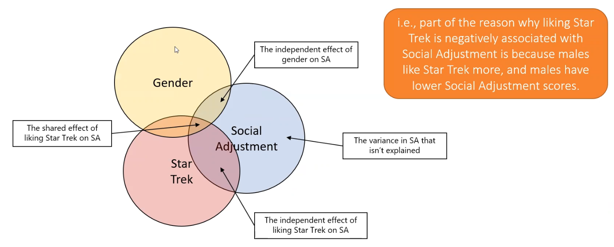

# Week 5 - Multiple Regression

# Shared Covariance

- one way to look at relationships between multiple X values and a Y value is to perform multiple univariate linear regressions
    - however, this assumes all effects of each X on Y are independent of each other
    - when summing the $R^2$ values, they can add up to over 1 (explaining over 100% of the variance in Y) which cannot be true
    - when looking at multiple X’s relationship at Y, look at their shared covariance (shared effect) and don’t consider this when looking at individual X’s relationship with Y

# The Multiple Regression Model

Remember, we model mean of Y given some combination of X variables:

$\mu_{Y|X_1,X_2...,X_k} = \beta_0+\beta_1X_1+\beta_2X_2+...+\beta_kX_k$

$\hat{Y} = \beta_0+\beta_1X_1+\beta_2X_2+...+\beta_kX_k$

Predicted Y for modeling individual’s Y value:

$Y = \beta_0+\beta_1X_1+\beta_2X_2+...+\beta_kX_k + e$   

- (where e is residual with mean 0 and variance $\sigma^2$)

$\beta_0$: the predicted value of Y when all X variables equal 0

$\beta_k$: the estimated difference in mean Y associated with a 1-unit change in $X_k$, **when all other X variables are held constant**

- slope estimates represent partial regression coefficients

- multiple $R^2$ now reflects proportion of variance in Y that is explained by all the X variables in the model
- in simple linear regression, $\sqrt{R^2} = R$ reflected the correlation between X and Y
- in multiple linear regression, multiple R reflects the correlation between *************an optimally-weighted linear combination of independent variables************* (i.e., our predicted value of Y) and the actual value of Y
    - the correlation between predicted and observed
- unlike r, multiple R always ranges between 0 and 1

# Multiple Regression Model Assumptions

******************Linearity******************

- the mean of Y is a linear function of the independent variables
- because all the X variables are included together, can’t just look at a plot of Y vs. any specific X; have to examine the residuals for this
- `car` (Companion to Applied Regression) package gives tools for evaluating regression models
    - `car::residualPlots(mult_reg.m)`
    - the t-tests in the output are for curvature
        - a significant p-value indicates a change in the location of the residuals over X
        - so, non-significant = OK

********Normality********

- the same: for any fixed values of $X_1, X_2, ... , X_k$, Y has a normal distribution
- with large N, the central limit theorem makes inferences robust to deviations from this assumption

********************************Homoscedasticity********************************

- for any fixed values of $X_1, X_2, ... , X_k$, the variance of Y is constant
- technically, want to see that the variance of Y is constant across the multivariate distribution of X values
    - difficult to do, so we examine variance of Y across the fitted values of Y

# Collinearity

- Example: participants were surveyed prior to cruise with all you can eat plan on how much they liked French fries and potato chips (scale 1 - 100) and their weight was measured pre and post trip
- while individually, liking fries or chips seem to be strongly associated with weight gain, they lose their individual significance when modeled together
- this is a case of collinearity
    - the X variables are highly correlated (r = 0.95) and share the same variance with the outcome
    - the shared covariance, which is really high, was removed in the multiple regression model
    - the F-test is still significant because it will test the contribution of fries, the contribution of chips, and the shared covariance
- Also causes issue with ANOVA (the sum of squares explained by each of the X variables differs depending on the order of when they were entered into the model)
    - this is because the `anova()` function shows **************Type I (sequential) Sums of Squares**************
    - adding the second correlated independent variable doesn’t contribute anything to explaining the variance in Y
- We can solve this by using **********Type III (simultaneous) Sums of Squares********** from the `car` package
    - note that in this approach the sum of all SS values does not equal the total SS in Y
    - this is because it excludes the shared covariance in the ANOVA and just includes the variances explained by each of the individual variables
- Other consequences of collinear variables:
    - unexpected changes in sign of regression coefficients
    - standardized coefficients greater than 1
    - highly-inflated standard error estimates
- How to diagnose collinearity:
    - ************************************************variance inflation factor (VIF)************************************************: the amount the standard errors have been inflated by because of inclusion of other correlated variables
        - rule of thumb: VIF > 10 indicates serious issues with collinearity
    - ********tolerance********: 1/VIF
- What to do with collinear variables?
    - sometimes centering variables can help
    - when highly collinear, they provide similar information about Y and little is lost by including only one
    - but which variable to drop?
        - least significant in single linear regression model
        - highest VIF value
        - less missing data
        - harder or more expensive to obtain

# Regression Diagnostics

“Good” models:

1. satisfies the assumptions of linear regression
2. generalizes to some population of interest
    1. typically addressed through study design, but also by detection of outliers
3. accurately estimates the relationship between Y and each X
    1. adequate sample size, no collinearity, account for confounding and effect modification
4. has some basis in reality
    1. more complicated models are harder to interpret; best models are simple yet good

- the best way to evaluate all of the above points is to know your data (pre-regression)
    - view/print data
    - do EDA (means, maximums, minimums)
    - histograms, scatterplots to spot potential data errors
    - correlation matrices to understand pairwise relationships among variables
    
- diagnostics definitions (for post-regression)
    - **outlier**: rare or unusual observation that appears at one of the extremes of the univariate or multivariate distributions
    - **leverage** ($h_i$): the extremeness of an observation with respect to the independent variables. The leverage of a data point depends on the distance of its X-value from the corresponding mean of all X values
        - i.e. a point is far from the mean of all X values
        - $h_i = \frac{1}{n}+\frac{(X_i-\bar{X})^2}{(n-1)S_X^2}$
    - **influence**: data point is influential if it by itself has a substantial impact on the parameter estimates (slopes, intercept) in a model. This typically happens when an observation is an outlier with high leverage (extreme in X and an unusual pattern of Y|X)
    
- advanced residual analysis
    - there are differences among the types of residuals we can examine
    - **************************true residual**************************: (bit of abstract concept). The errors $e_i$ are assumed to have mean 0 and variance $\sigma^2$. We can never really tell what the true residual is, as we can only measure them empirically based on the model chosen
    - ************************************estimated residual************************************: what we are accustomed to calculating. This is give as: $\hat{e_i} = Y_i - \hat{Y_i}$. The mean of all estimated residuals is 0.
    - ******************************************standardized residual******************************************: $z_i = \frac{\hat{e_i}}{S}$. Essentially, each residual is converted to a z-score by dividing by the standard deviation of all residuals.
        - because they are standardized, we can immediately determine how extreme the residual value is
    - ****************************************studentized residual****************************************: $r_i = \frac{z_i}{\sqrt{1-h_i}}$. These values follow a T distribution with n-k-1 degrees of freedom if regression assumptions are met
    - ************************************jackknife residual************************************: $r_{(-i)} = \frac{\hat{e_i}}{S_{(-i)}\sqrt{1-h_i}}$, where $S_{(-i)}$ is the standard deviation of the residuals computed from a model where the ith observation is deleted.
        - useful for identifying influential points
        - values follow a T distribution with n-k-2 degrees of freedom if regression assumptions are met
        - Jackknife residuals are large when the standardized residual is large
    
- measures of influence
    - 3 statistics that quantify the amount of influence an observation has on the estimated regression slope(s) or predicted value of Y
    1. ********************************Cook’s Distance********************************
        1. measures how much all the fitted values change with the deletion of each observation
        2. $d_i = \frac{e_i^2h_i}{(k+1)S^2(1-h_i)^2} = \frac{r_i^2h_i}{(k+1)(1-h_i)}$
        3. observations with $d_i$ > 0.5 may be worth investigating
        4. observations with $d_i$ > 1 are likely worth investigating
    2. **************DFBETAS**************
        1. measure of how much the regression coefficients change with the exclusion of the ith observation
        2. $\Delta\beta = \frac{\hat{\beta}-\hat{\beta}_{(-i)}}{S_{(-i)}\sqrt{\Sigma X_i^2}}$
        3. observations > $\frac{2}{\sqrt{n}}$ are influential
    3. ************DFFITS************
        1. measure of how much the predicted value for the ith observation changes when the ith observation is deleted
        2. $\Delta\hat{Y}_i = \frac{\hat{Y}_i - \hat{Y}_{i_{(-i)}}}{S_{(_i)}\sqrt{\Sigma h_i}}$
        3. observations > $\frac{2}{\sqrt{\frac{k}{n}}}$ are influential

- R command for plotting Cook’s Distance:
    - `ols_plot_cooksd_bar(re.m)`
- For DFFITS:
    - `ols_plot_dffits(re.m)`
- Jackknife (externally studentized) residuals:
    - `ols_plot_resid_stud(re.m)`
- Studentized (internally studentized or “standardized”) residuals
    - `ols_plot_resid_stand(re.m)`
- Leverage vs. Studentized Residual:
    - `ols_plot_resid_lev(re.m)`
- To get influential stats directly:
    - `influence.measures(re.m)$infmat %>% as.tibble()`

- Summary of Residuals
    1. Standardized
        1. a Z-score of residuals
        2. Identifies outliers
    2. Studentized (internally)
        1. standardizes to a t-distribution
        2. accounts for leverage
        3. Identifies outliers
    3. Jackknife (externally studentized)
        1. studentized residual from fitting a model that deletes the observation in question
        2. identifies influential points
        3. better at identifying outliers on Y
    
- What to do when encountering problematic data points?
- check for obvious data errors
    - check accuracy of data point
    - delete point if it isn’t representative of your intended population
- consider the formulation of your model
    - did you leave out important predictors?
    - is there nonlinearity, or are there interactions that must be considered?
- always justify why you alter data
    - have a good objective reason for deleting data points
    - you can always perform “sensitivity” analysis; report the results with the data point included and excluded
