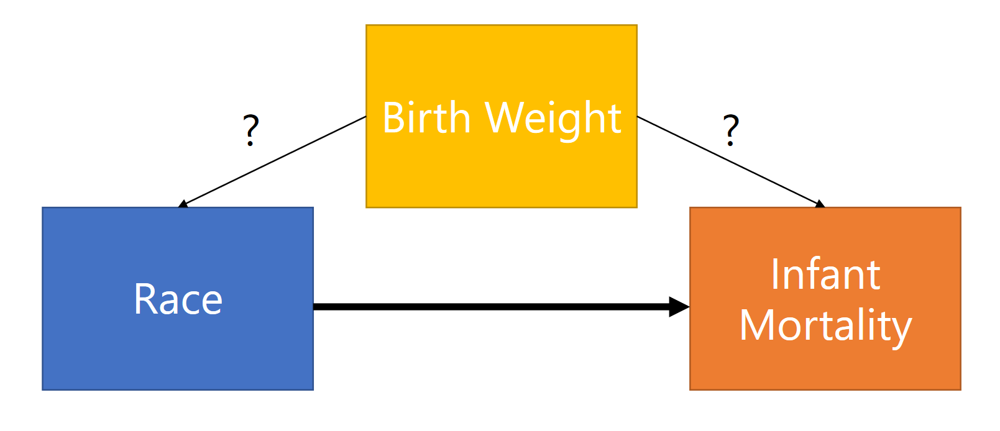
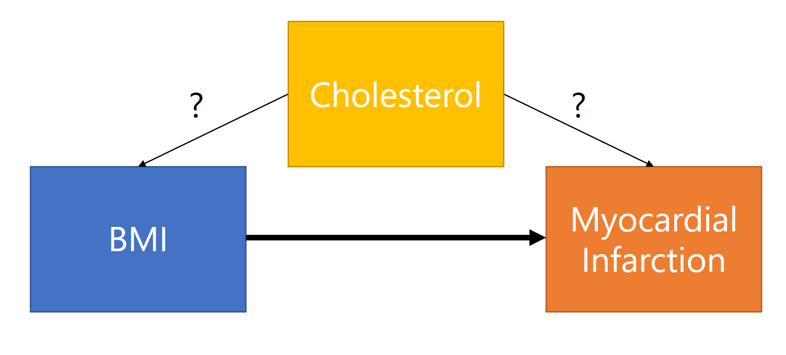

# Week 6 - Confounding & Interaction

How to capture the best association between X (or set of X) variable(s)

# Estimating Association / Extra SS Test

Primary purpose of multiple regression models is dependent on research question:

1. Estimating Associations
    1. multiple regression can model relationship between dependent variable and set of independent variables of scientific interest
    2. variables chosen due to **********************************hypothesis-driven********************************** interactions
    3. covariates chosen to best capture ********true effect******** of the IV on the outcome
    4. we include ******************************************confounding variables****************************************** (variables that confound relationship between X and Y) and **********effect modifiers********** (variables that modify the relationship between X and Y)
- When estimating associations
    - model coefficients reflect slope adjusting for all other variables in the model
        - validity of this adjustment is contingent on the correct covariates being included and the covariates being modeled correctly (e.g. correct assumption of linearity, interactions modeled correctly)
        - goal of this approach is to model the true association between independent variables of interest and the outcome
1. Predicting Outcome
    1. Main goal isn’t to examine a hypothesized association, but to find the best way to predict an outcome (more common in Data Science)
    2. Good prediction models use a parsimonious set of independent variables
    3. Goal: find a set of variables that best predicts outcome

How to know if an additional variable improves model fit

1. Extra Sums of Squares Test
    1. Compare the SS of the model with an additional variable vs. the SS of the model without it
    2. Previously, this test was used to determine:
        1. if a single binomial parameter is statistically significant (compare to null hypothesis)
        2. if a dummy variable set is statistically significant (i.e., joint significance of all variables)
    3. The F-test shown in model summary output reflects the significant improvement in sum of squares compared to a model with nothing in it: (`lm(y ~ 1, data=data)`)
        1. F-statistic is the extra sums of squares test for the *******current******* *****model***** being considered
        2. F-statistic formula:
            1. $F_{(DFE_0-DFE_1,DFE_1)} = \frac{\frac{SSE_0-SSE_1}{DFE_0-DFE_1}}{\frac{SSE_1}{DFE_1}}$, where $E_0$  is the null model (modeled on `1`), and $E_1$ is the model with IV(s)
    4. So you can compare two linear models (one with the addition of another variable) by using the same test:
    
```r
m1 <- lm(enjoy_ex1 ~ intervention, data = places)
m2 <- lm(enjoy_ex1 ~ intervention + racecat , data = places)    
anova(m1, m2)
```
    
- the F statistic and p-value in the ANOVA results gives the improvement of fit by adding the race category variable
- Extra SS test is useful for determining if set of variables improves the model
    - when only one variable added to model, the test will mirror the Wald (t) test
    - must be used on nested models (i.e. parameters in nested model must appear in the full model)

# Confounding

- When the association of interest between the outcome variable and a specific independent variable is distorted by the influence of a third (or more) variable
- Two criteria for confounding:
    1. Change in effect estimate criterion: the adjusted estimate is at least 10-20% different than the unadjusted estimate (i.e. the parameter of interest must change in presence of the confounder)
    2. The variable must sensibly be able to be a cause of both X and Y
- By including the confounder in your model, you will be able to calculate the effect of X on Y that is not due to the confounder
- Example: Is the relationship between personality type and SBP confounded by age?
    - perhaps the likelihood of being type B personality increases with age, and older people are more likely to get high blood pressure
    - so in this model, it may look like type B personality causes SBP, but really its age that is causing SBP and it also happens to be inflating type B personality
    - assess confounding through change in parameter estimates:

```r
m3 <- lm(sbp ~ factor(dibpat), data = wcgs)
# coefficient for beta 1 is -2.32

m3a <- lm(sbp ~ factor(dibpat) + age, data = wcgs)
# coefficient for beta 1 is now -1.89
```

- using the formula: % change = $\frac{\beta_{unadjusted} - \beta{adjusted}}{\beta_{unadjusted}}$
    - $\frac{-2.32 - (-1.89)}{-2.32} = 18.5%$
    - with the 18.5% change, it appears that age confounds the relationship between personality type of SBP
- How to pick confounders to examine:
    - Philosophically — sometimes variables are ********a priori******** included automatically because they have been traditionally examined as confounders (e.g. age, gender, race)
        - demographic variables are most likely to be confounders
    - Statistically — sometimes don’t have adequate information to choose all potential confounders
        - in the CHS study, pets, carpet type, air conditioning, multivitamin, etc. can be potential confounders of relationships with lung function
        - including many “adjustment” variables can pose several problems:
            - when individuals are **************missing************** on certain adjustment variables, those individuals may be eliminated from analysis, reducing power and potentially biasing effect estimates
            - ****************************reduced power****************************: as more predictors are added to the model the error degrees of freedom decreases —> leads to heavier tails in t-distribution —> need larger t value to reject null hypothesis
            - ******************************increased power******************************: standard error of all slope coefficients = function of estimated standard deviation of the residuals. If adjustment variables added, they can reduce the standard deviation —> the SE will be smaller and the t-value will be larger
                - we don’t know exactly how additional variables will affect the power
            - large model with many non-significant X-variables violates desire to  have minimal (parsimonious) model that predicts outcome well
    - Confounder — is birth weight a sensible confounding variable?




- No, birth weight cannot cause age

- Can cholesterol sensibly be a confounder?



- It isn't clear whether cholesterol causes BMI or if BMI causes cholesterol

    - Study Design:
        - ideally, potential for confounding variables reduced in experimental studies (individuals are randomized into treatment groups) so treatment/exposure groups are similar in terms of potential confounding variables
        - example: is age a confounding variable in the relationship between Smart Growth Community (X) and physical activity (Y)?
            - in an observational study: perhaps younger less-established people tend to move to smart growth community and younger people also tend to exercise more
            - in an experimental study: enrollment in the Smart Growth Community is randomized (ex: people wanting to move to SGC are entered into lottery and half move and half remain where they are). Now, there is no way age can cause moving to smart growth community
        - experimental studies are not always possible, so we have to settle for observational studies
            - in this case, there may be pre-existing associations we need to control for

- Mediators
    - confounders are variables that cause spurious association between an X and Y variable of interest
    - mediators are variables that are intermediary steps in a causal pathway between X and Y
    - Theory of Planned Behavior posits that the relationship between an X variable and a behavioral outcome is mediated by intentions
        - in the Smart Growth Community example, intentions for physical activity is a mediator in a causal pathway between moving to a smart growth community and physical activity
    - mediators beyond scope of course but their effects can be assessed with path analysis

# Effect Modification (Categorical)

- From confounding, we can see that a third variable (Z) can cause it to seem like X is associated with Y more than it actually is because Z is related to both of them
- Another way Z can have an effect is when the association of interest depends on the *****level***** of the third variable
    - example: X is related to Y for males but not for females
    - beta coefficient is going to be different for males and females
- Example: 30 families asked about their ice cream consumption in past month and the following variables obtained:
    - CONS — ice cream consumption in pints per capita
    - INCOME — family income (in $1,000)
    - PRICE — price per ounce of ice cream ($)
    - TEMP — average temperature in past month
    - when the regression is run, the p-value for consumption regressed on price is not significant
    - but, when relationship is split between high and low income (above or below median):
        - for high-income families, higher price is associated with lower consumption and for low-income families, higher price is slightly associated with higher consumption
    - instead of analyzing two models separately, can write as one equation:
        - $\mu_{Y|X1,X2} = \beta_0+\beta_1X_1+\beta_2X_2+\beta_3X_1X_2$
        - the variables are said to interact if $\beta_3 \neq 0$
    - Derivation of equation:
        - For low-income: ($X_{hiincome} = 0$):
            - $\mu_{Y|X1,X2} = \beta_0+\beta_1(0)+\beta_2X_2+\beta_3X(0)X_2 = \beta_0 + \beta_2X_2$
        - For high-income: ($X_{hiincome} = 0$):
            - $\mu_{Y|X1,X2} = \beta_0+\beta_1(1)+\beta_2X_2+\beta_3X(1)X_2 = \beta_0 + \beta_1 + \beta_2X_2 + \beta_3X_3 = (\beta_0 + \beta_1) + (\beta_2 + \beta_3)X_3$
        - we get different intercept and slope for low income and high income
    - How to perform the interaction inclusion in R:
        - create third variable by multiplying price by whether income is higher than median (high or low)
    
```r
ic <-
    ic %>%
    mutate(price_hiincome = price * (income > median(income)))
    
lm(formula = cons ~ price + hiiincome + price_hiincome, data = ic)
```
    
- look at the p-value for the interaction term to see if it is statistically significant
- The interaction term describes how the slope changes:
    - an interaction coefficient of -6.91 means that for every 1-unit increase in $X_{hiincoome}$, the *****slope***** associated with $X_{price}$ decreases by 6.91 units
    - if the equation were:
    - $\hat{Y} = -0.22 + 1.90X_{hiincome} + 2.11X_{price} - 6.91X_{hiincome}X_{price}$,
    - then those with income below median:
        - $\hat{Y} = -0.22 + 1.90(0) + 2.11X_{price} - 6.91X(0)X_{price} = -0.22 + 2.11X_{price}$
    - and those with income above median:
        - $\hat{Y} = -0.22 + 1.90(1) + 2.11X_{price} - 6.91X(1)X_{price} = 1.68 + 4.80X_{price}$
- another way to create the interaction term automatically in R:
    
```r
lm(formula = cons ~ price * hiincome, data = ic)
```
    
- Notes on interaction terms:
    - **************************Main Effects************************** refer to the effects (variables) in model without modeling interaction (e.g. affect of price on consumption regardless of income category)
    - if the **************************************************************interaction term is significant************************************************************** then you should retain the effects of all variables included in the interaction term — regardless of significance
    - detecting an interaction requires **********************************larger sample size********************************** than for main effects; typically 4n, where n is the sample size required to detect a main effect at 80% power
        - may want to be more liberal with the $\alpha$ level for interactions (e.g. $\alpha$ = 0.15)

# Effect Modification (Continuous)

- previously, continuous-by-dichotomous (categorical) interactions are easier to interpret because the dichotomous variable can be stratified
- it is especially useful to center all variables when looking at interactions
- suppose looking at the same interaction as before, but looking at income as a continuous variable:

$$
\hat{Y} = \beta_0 + \beta_1X_{INCOME.C} + \beta_2X_{PRICE.C} + \beta_3X_{INCOME.C}X_{PRICE.C}
$$

```r
ic.m3 <- lm(cons ~ price.c*income.c, data = ic)
```

- remember, the p-value for the interaction term tells if the interaction is statistically significant
- the equation becomes:

$$
\hat{Y} = \beta_0 -0.002X_{INCOME.C} - 1.285X_{PRICE.C} - 0.696X_{INCOME.C}X_{PRICE.C}
$$

- Two ways to interpret the main effects:
    1. At the mean value of $X_{INCOME.C}$, a one-unit increase in $X_{PRICE.X}$ is associated with a predicted decrease ice cream consumption of 1.285 units (p=0.34)
    2. At the mean value of $X_{PRICE.C}$, a one-unit increase in $X_{INCOME.C}$ is associated with a predicted decrease in ice cream consumption  of 0.002 units (p=0.25)
    - remember, the variables are centered on the mean, so $X_{INCOME.C}$ = 0, it is the mean income, and it goes away in the equation
- Two ways to interpret the interaction term:
    1. For every one-unit increase in $X_{INCOME.C}$, the slope associated with $X_{PRICE.C}$ decreases by 0.696
    2. For every one-unit increase in $X_{PRICE.C}$, the slope associated with $X_{INCOME.C}$ decreases by 0.696
- Can use **************************simple slopes************************** to examine effect of continuous-by-continuous interaction term
    - look at the effect of one variables by levels of another variable — typically at the mean, -1 standard deviation, and +1 standard deviation
    - use `interactions` package in R to determine the statistical significance of the slopes

```r
sim_slopes(ic.m3, pred = price.c, modx = income.c, johnson_neyman = F)
```

Tying back to goals of data analysis and recommendations:

|  | Model of Association | Prediction Model |
| --- | --- | --- |
| Goal | Explain the true relationship between an X (or set of X) variable and an outcome | Use a set of X variables to find the model that can best predict the outcome. |
| Variables | Choose based on theoretically meaningfulness of associations (e.g., which variables may be distorting the relationship between X and Y) | Choose based on what might be associated with the outcome. |
| Method | Control for confounding. Examine effect modification. Keep variables that explain the “true” relationship between X and Y. | Confounding is not important. Examine effect modification. Keep variables that improve model fit. |
| Metrics | R-squared, parsimony, ensuring you have considered all possible confounders. | R-squared, parsimony, validation with an external data set. |

Recommendations:

- Keep variables continuous when possible. Categorizing may be more interpretable at the expense of losing some information.
- Keep all lower-order terms for significant interactions. When an interaction is included in a model, keep all variables included in the interaction term (regardless of significance)
- Check interactions first. Because interactions reflect strata-specific effects, check for interaction variables before assessing confounding.
- Don’t get overwhelmed. Stick to ********a priori******** hypothesized interactions, or interactions that make the most sense. This reduces the number of possible variables you have to look at.
- Stick to parsimony. A good model attempts to simplify reality while retaining accuracy.


Notes:

The difference between confounding and effect modification:

- Effect modification is all about stratification -- it occurs when an exposure has a different effect among different subgroups. It is associated with the outcome, but not the exposure.
    - e.g. you are testing out a new drug, Drug X. If Drug X works on females but not in males, this is an example of effect modification

- Confounding occurs when a factor is associated with both the exposure and the outcome but doesn't lie on the causative pathway (mediator)
    - e.g. you are looking for association between coffee and lung cancer -- this association may be distorted by smoking if smokers are unevenly distributed between the two groups. It may appear that there's a relationship between coffee and lung cancer, but if you were to consider smokers and non-smokers separately for each group, this would show no association
