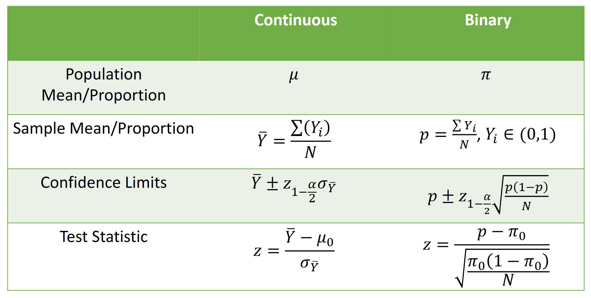

# Week 8 - Logistic Regression I

# Introduction to Binary Outcomes

Types of Binary Variables

- The outcome is *inherently* binary (male/female, disease/non-disease)
- The outcome is continuous by categorized into some *meaningful cut-point* (scale score > a particular value, indicating depression vs. no depression)
- The outcome is continuous but ***************************************does not display a linear relationship*************************************** with the predictors
- The outcome is dichotomized on some *arbitrary cut-point* (median, mean)



Example:

Is there evidence that the asthma percentage for adolescents in Southern California (CHS) different from the national average of 10%?

$H_O: \pi = 0.10$

$H_A: \pi \ne 0.10$

- The Z test for this is given from the z formula for the test statistic above.
- To do this in R:

```r
z.test.prop(chs$asthma, .1)
# null proportion = .1
```

- the `p` in the output gives the proportion of participants in CHS with asthma and `pval` is significance of the test. Also gives upper and lower 95% CI

2x2 Contingency Tables

- a way to summarize the relationship between two categorical variables
- has i rows and j columns, with $n_{ij}$ counts in each cell


- white cells are number of people with each combination of X and Y
- Three ways to estimate associations in 2x2 tables:
    - **Risk Difference**
    - **Relative Risk**
    - **Odds Ratio**
- Example: is there an association between regular aspirin use and experiencing a heart attack (MI = myocardial infarction)?

|  | MI | No MI | Total |
| --- | --- | --- | --- |
| Aspirin | 104 | 10933 | 11037 |
| No Aspirin | 189 | 10845 | 11034 |
| Total | 293 | 21778 | 22071 |
- proportion of those who had MI given that they took aspirin = $\hat{\pi}_{\text{MI|aspirin}} = \frac{104}{11037} = 0.00942$
- proportion of those who had MI given that they did not take aspirin = $\hat{\pi}_{\text{MI|no\:aspirin}} = \frac{189}{11034} = 0.01713$
- initially, it looks like more people had heart attack when no aspirin taken
- **Risk Difference**
    - risk difference for group 2 vs group 1 is the difference in proportions ($\pi_1-\pi_2$)
    - if variables are **********************independent**********************, the difference is 0
    - the range of differences is -1 to +1
    - in the case above the difference in proportions is 0.9% - 1.7% = 0.77%
        - the people in the no aspirin group have a 0.77% increased risk of heart attack compared to those in the aspirin group
- ************Relative Risk************
    - ratio of proportions $\frac{\pi_1}{\pi_2}$
    - if variables are ************independent************, the ratio is 1
    - the range of relative risk is 0 to $\infty$
    - in the case above the relative risk is 0.9%/1.7% = 0.55
        - the risk of heart attack for those who take aspirin is about 55% the risk of heart attack for those who don’t take aspirin
- **Odds Ratio**
    - ratio of odds (not proportions) $\frac{\pi_1(1-\pi_1)}{\pi_2(1-\pi_2)}$
        - odds of an event happening are given as the probability that event happens divided by the probability that the event does not happen
        - if $p$ = the probability of event, the odds = $\frac{p}{1-p}$
    - if variables are **********************independent**********************, the ratio is 1
    - the range of the odds ratio is 0 to $\infty$
    - in the case above, the odds ratio (OR) is given by:
        
        
        |  | MI | No MI | Total |
        | --- | --- | --- | --- |
        | Aspirin | A | B | A+B |
        | No Aspirin | C | D | C+D |
        | Total |  |  |  |
        - $\text{OR} = \frac{\frac{p_1}{(1-p_1)}}{\frac{p_2}{(1-p_2)}} = \frac{p_1(1-p_2)}{(1-p_1)p_2}$
        - $= (\frac{a}{a+b})(\frac{a+b}{b})(\frac{d}{c+d})(\frac{c+d}{c}) = \frac{ad}{bc}$
            - $\text{OR} = \frac{(104)(10845)}{(10933)(189)} = 0.55$
        - the odds of heart attack among those taking aspirin is 0.55 times that of not taking aspirin
        - in many cases odds ratio approximates relative risk

# The Odds Ratio

- If X reduces the odds of Y, the range of odds ratio sizes is (0, 1)
    - for example, if OR = 0.24 then the odds of the outcome in the first exposure group are 0.24 times the odds of the outcome in the second exposure group
- If X increases the odds of Y, the range of odds ratio sizes is (1, $\infty$)
    - if OR = 3.15, the exposure increases the odds of the outcome
- This means that the sampling distribution of the OR is highly skewed
- However, the distribution for the **log odds** ($\ln(\text{OR})$) is not!


- The ln(OR) can be linked to the OR

| If… | Then… | Effect |
| --- | --- | --- |
| OR = 1 | ln(OR) = 0 | no association |
| OR < 1 | ln(OR) < 0 | protective effect of the exposure |
| OR > 1 | ln(OR) > 0 | risk effect of the exposure |
- The ln(OR) has approximately symmetric sampling distribution
- And, its standard error is easily calculated:

$$
\text{SE}(\ln(\text{OR})) = \sqrt{\frac{1}{n_11}+\frac{1}{n_12}+\frac{1}{n_21}+\frac{1}{n_22}}
$$

- So, a 95% CI for ln(OR) is: $\ln(\text{OR}) \pm 1.96\:\text{SE}(\ln(\text{OR}))$
- For the example: $\ln(0.55) \pm 1.96\sqrt{\frac{1}{189}+\frac{1}{10933}+\frac{1}{104}+\frac{1}{10845}} = (-0.84, -0.36)$
- To get the 95% CI for the odds ratio, exponentiate the values: $(e^{-0.84}, e^{-0.36}) = (0.43, 0.70)$
    - in converting ln(OR) CI to OR CI, the range becomes non-symmetric
    - this is reflective of the fact that the range of possible values changes from ($-\infty,\infty$) to ($0,\infty$)

- Additional nice properties of OR:
    - doesn’t change if rows and columns exchanged in contingency table
    - doesn’t change if cell frequencies within a row or column are multiplied by non-zero constant (multiplicative invariance property) — this will change the CI though
    - related to Risk Ratio: $\text{OR} = \frac{p_1}{p_2}(\frac{1-p_2}{1-p_1}) = \text{RR}(\frac{1-p_2}{1-p_1})$
        - when probability of outcome is small (p → 0) the OR and RR will be very similar
- Implications
    - when computing OR for association between two variables, it isn’t important which one is classified as “exposure” and which is the “outcome”
    - shouldn’t change depending on sampling frequencies for exposure or outcome (RR does)
    - if $p_1$ and $p_2$ are close to 0 (i.e., rare disease assumption) the OR approximates the RR. This means that in case-control studies where the disease is rare, the OR can be used to approximate the RR

Test Yourself:

- Suppose the study on Aspirin and MI was a case-control, so all 293 with MI were sampled and 293 samples without MI were randomly sampled. Assume the 293 subjects without MI had the same exposure probability that was previously calculated.

|  | MI | No MI | Total |
| --- | --- | --- | --- |
| Aspirin | 104 | (10933/21778)*293 = 147 | 251 |
| No Aspirin | 189 | (10845/21778)*293 = 146 | 335 |
| Total | 293 | 293 | 586 |
- The odds of not using aspirin for those who had a MI = (189/293)/(104/293) = 1.82
- The odds of not using aspirin for those who did not have a MI = (146/293)/(147/293) = 0.99
- The OR of not using aspirin for those with MI vs. those without MI = (189*147)/(104*146) = 1.82/0.99 = 1.83
- Interpretations:
    - Those that didn’t use aspirin had 1.83 times the odds of MI versus those that didn’t use aspirin
    - Those with MI had 1.83 times the odds of not using aspirin compared to those without MI
        - remember: doesn’t matter which variable is row or outcome
- Note:
    - The OR of MI for aspirin compared to no aspirin is (104*146)/(189*147) = 0.55
    - The OR of MI for no aspirin compared to aspirin is (189*147)/(104*146) = 1.83

How to test if the relationship is statistically significant?

- **********************Pearson Chi-Square Statistic**********************
    - compares observed cell frequencies to frequencies that would be expected if X and Y were not related
- ****************************************Likelihood Ratio Chi-Square Statistic****************************************

Pearson Chi-Square Statistic

- based on multinomial likelihood
- $\text{Pearson}\:\chi^2=\sum{\frac{(n_{ij}-\mu_{ij})^2}{\mu_{ij}}}$
- if the null was true, we ************expect************ each cell value $\mu_{ij}$ to be equal to the product of its row and column marginal values
- this would result in the numerator to ⇒ 0 and the resulting chi-square statistic would be small


- $\mu_{ij} = n\pi_i.\pi_j.$
    - Under $H_0: \pi_{ij}=\pi_i.\pi._j.$, for all i,j
- Under null hypothesis (independence), when expected frequencies are large, both statistics follow a Chi-square distribution
    - has one parameter: df
    - for this distribution, mean = df, and variance = 2df
    - if expected cell frequencies are not large (< 5 in any cell), then different methods such as Exact test may need to be used instead
- How to determine degrees of freedom:
    - The df is the difference between the number of parameters under $H_A$ and $H_0$
    - Under $H_0$, the marginal probabilities determine the cell probabilities. There are I - 1 and J - 1 nonredundant marginal probabilities
    - Under $H_A$, the cell probabilities are unrestricted; they must simply sum to 1. There are IJ - 1 nonredundant cell probabilities.
    - $df = [IJ-1]-[(I-1) + (j-1)] = (I-1)(J-1)$
    - calculate Chi-square statistic in R:

```r
tibble(
    aspirin = c(1, 1, 0, 0)
    mi = c(1, 0, 1, 0),
    freq = c(104, 10933, 189, 10845)
) %>%
    xtabs(freq ~ aspirin + mi, data = .) %>%
    chisq.test(correct = F)
```

- Another example: is there a relationship between gender and presence of asthma for adolescents in Southern California?

```r
chs %>%
    with(., table(asthma, male)) %>%
    chisq.test()
```

- $(\chi^2=5.9,\:p=.015)$ — there is a statistically significant relationship
- note: by default the `chisq.test()` uses the Yates’ continuity correction. In 2x2 tables, the continuous chi-square distribution is used, which tends to be more liberal, especially when expected cell counts are low (< 40). The Yates’ correction makes the test more conservative, but some argue too conservative
    - attempt to correct for the fact that we are using this continuous distribution on discrete data

# The Logit Link

The Generalized Linear Model

- The `glm()` command can let us model things when the outcome is different than what we’re used to with `lm()`
- Up to this point, we have focused on the linear model `lm()`, which has
    - a random component (residual)
        - recall one of the assumptions of linear regression: normality
        - we assume observed Y follow some random distribution, with $E(Y) = \hat{Y} = \mu$
            - (predicted value of Y equal to some mean)
        - for each observation i (i =1, …, n) the $Y_i$  are IID (independent and identically distributed)
        - for linear regression, the random component (probability distribution) is $Y_i\sim \text{Normal}(\mu, \sigma^2)$
    - a systematic component (intercept, slope)
        - specifies the form of the independent variables
        - specified as a linear function: $\eta_i = \sum_{j=1}^{p}\beta_jx_{ij}$
            - $\eta_i$ is called the linear predictor
            - $\sum_{j=1}^{p}\beta_jx_{ij} = \beta_0 + \beta_1x_1 + \beta_2x_2 + ...$
        - this means:
            - flexibility: we can easily include x variables that are a combination of other variables (e.g., interactions: $x_3 = x_1 * x_2$) or transformations (e.g. $x_2 = x_1^2$)
            - interpretability: the linear predictor has a range of $-\infty$ to $\infty$
    - a link function
        - In OLS regression we dealt with variables where:
            - the association between predictor and outcome is linear and
            - the prediction can take on values between $-\infty$ to $\infty$
                - so, we can **directly use the predictions** given by the model
            - when wouldn’t it make sense for the predicted value to have a range of $-\infty$ to $\infty$?
                - when the outcome is bounded — e.g. probabilities are bounded by [0,1]; count variables have a lower limit of 0
            - when would our outcome not follow a normal distribution?
                - binomial, multinomial, Poisson, etc.
        - The **link function** allows us to use linear systematic components to predict an outcome that isn’t necessarily normally distributed
        - we have to ask: what **********transformation of Y********** would express the systematic component as a linear function of the covariates?
        - the link function is given as $g(\mu)$:
        
        $$
        g(u) = \beta_0+\beta_1x_1+\beta_2x_2+...=\sum^{p}_{j=1}\beta_jx_{ij}
        $$
        
        - it is a transformation we make on the expected value so it conforms to a different distribution
        - for linear regression, we don’t need to perform any transformation on the outcome $Y = \beta_0 + \beta_1x_1 + \beta_2x_2 + ...$, we can use the predicted Y values as-is
            - so the identity link is: $g(\mu) = \mu$

- Linear models use the **identity link**
- Models that are nonlinear use a different link
- **Intercept**. For any GLM, the intercept $\beta_0$ is the **expected value of the link function** $g(\mu)$ when all values of the independent variables $x_k$ are zero
- **Slope**. For any GLM, the slope parameters ($\beta_1-\beta_k$) are interpreted as **the change in the link function**, $g(\mu)$, per unit of $x_k$

Example: examine a model to predict child’s asthma from mother and father

- this poses a bit of a problem as the outcome and predictor are dichotomous
- we can get a result, but there is no guarantee that the model will make sense
- the range of linear regression is ($-\infty$ to $\infty$). Since the outcome is a probability, anything outside of [0,1] is nonsensical
- additionally, performing an OLS regression on a binary outcome will ensure that the residuals are NOT normally distributed (though this is less of a problem with larger sample size)
- Solution: **the logit link**
    - The logit is one function that will yield predictions constrained between 0 and 1
    
    $$
    \text{logit}(\pi_i) = \ln(\frac{\pi_i}{1-\pi_i})
    $$
    
    - logit is another way of saying log odds; this is the same formula for the log odds
    - note: we could also use $\mu_i$ instead of $\pi_i$
    - In extreme cases:
        - when $\pi = 0: \text{logit}(0) = \ln(\frac{0}{1-0}) = - \infty$
        - when $\pi = 1: \text{logit}(1) = \ln(\frac{1}{1-1}) = \infty$
    - this is nice because we can model something in the logit the same way the continuous outcomes have been modeled before
    - if we model something in the logit, we can model anything between $- \infty$ and $\infty$ and once we get the value of the logit, we can back transform it into an actual probability

- We can use the linear systematic component to model the logit (instead of Y directly)
- Using the logit link: $\text{logit}(\pi_i) = \ln[\frac{\pi_i}{1-\pi_i}] = \beta_0 + \beta_1x_1 + ...+ \beta_kx_k$


- this model is “linear in the logit”
- Transforming the equation in terms of Y:

$$
\mu_i =\pi_i = \frac{e^{\beta_0 + \beta_1x_1 + ...+ \beta_kx_k}}{1+e^{\beta_0 + \beta_1x_1 + ...+ \beta_kx_k}}
$$


- we can see that after we transform X, it is not linearly related to the actual probability
- Some properties:
    - predicted probability asymptotically approaches 0 and 1
    - change in x has less impact on E(Y) at the extremes
    - change in x has more impact on the expected probability in the mid-range of $\pi$
- Interpreting Parameters:
    - $\text{logit}(\hat{\pi}) = \beta_0+\beta_1X_1$
    - the intercept is the log odds that Y = 1 when X = 0
    - when X = 0, $\text{logit}(\hat{\pi}) = \beta_0$.
        - we can convert this to a “baseline probability” (probability of observing Y = 1 when all X = 0):
    
    $$
    \text{P(Y=1|X=0)} = \frac{e^{\beta_0}}{1+e^{\beta_0}}
    $$
    
    - the slope $\beta_1$ is the change in log odds (logit) for a 1-unit increase in X
    - looking at slope in terms of predicted probability instead of predicted logit:
        - the predicted probability…

$$
\pi_{Y=1} = \text{P[Y = 1|x]} = \frac{\text{exp}(\beta_0+\beta_1x_1)}{1+\text{exp}(\beta_0+\beta_1x_1)}
$$

$$
\pi_{Y=0} = \text{P[Y = 0|x]} = \frac{1}{1+\text{exp}(\beta_0+\beta_1x_1)}
$$

- We can use this information to get the ********odds******** of an event:
- (The odds of Y = 1 when X = 1 divided by the odds of Y = 0 when X = 1):

$$
\pi_{Y=1} = \text{P[Y = 1|X = 1]} = \frac{\text{exp}(\beta_0+\beta_1(1))}{1+\text{exp}(\beta_0+\beta_1(1))} \\\ \pi_{Y=0} = \text{P[Y = 0|X = 1]} = \frac{1}{1+\text{exp}(\beta_0+\beta_1(1))} \\\ \frac{\pi_{Y=1}(1)}{\pi_{Y=0}(1)}=\text{ODDS[Y = 1|X = 1]} = \text{exp}(\beta_0+\beta_1)
$$

- (The odds of Y = 1 when X = 0 divided by the odds of Y = 0 when X = 0):

$$
\pi_{Y=1}(0) = \text{P[Y = 1|X = 0]} = \frac{\text{exp}(\beta_0+\beta_1(0))}{1+\text{exp}(\beta_0+\beta_1(0))} \\\ \pi_{Y=0}(0) = \text{P[Y = 0|X = 0]} = \frac{1}{1+\text{exp}(\beta_0+\beta_1(0))} \\\ \frac{\pi_{Y=1}(0)}{\pi_{Y=0}(0)}=\text{ODDS[Y = 1|X = 0]} = \text{exp}(\beta_0)
$$

- we can take the odds ratio as:
- (odds of event | x = 1) / (odds of event | x = 0)

$$
\text{OR} = \frac{\text{exp}(\beta_0+\beta_1)}{\text{exp}(\beta_0)} = \text{exp}(\beta_1)
$$

- this means that if we exponentiate the beta coefficients in our model output, we directly obtain the odds ratio for a 1-unit increase in X

FAQ

- odds ratio has nice properties that allows for direct interpretation of the parameter estimates from the model output
- odds ratio is the easiest way to directly interpret coefficients
- odds ratio is the (multiplicative) change in odds of outcome associated with a one-unit change in x

Recap

- odds ratio is interpreted as change in odds of outcome associated with a one-unit change in x
- when outcome Y is binary, we only *******observe******* 0 or 1, but the expected value of Y ($\pi$, or $\mu$), [the expected probability of Y] falls between 0 and 1
- the logit link is $\ln(\frac{\pi(x)}{1-\pi(x)}) = \text{logit}(\pi(x)) = \beta_0 + \beta_1x_1+...$
    - ranges from $-\infty$ to $\infty$
    - logit is transformed to get predicted probability of outcome: $\pi(x) = \frac{\text{exp}(\beta_0+\beta_1x_1+...)}{1+\text{exp}(\beta_0+\beta_1x_1+...)}$
        - the predicted probability ranges from 0 to 1

# Logistic Regression Applied

2 ways to approach computing odds ratios:

1. Contingency Table

```r
chs %>%
    with(., table(asthma, asthma_parent))

# odds ratio = (A*D)/(B*C) = 3.72
# children are 3.72 times more likely to have asthma if they have parent who has asthma

chs %>%
    with(., table(asthma, asthma_parent)) %>%
    chisq.test(correct = F)
# p = 2.636e-13, association statistically significant
```

1. Logistic Regression

```r
glm(asthma ~ asthma_parent, data = chs, family = binomial) %>% summary()
```


- why do logistic regression if contingency table can achieve same result?
    - in a multiple regression model you can adjust for many different things and do interaction terms

Continuous predictors

- scatterplot not very helpful in visualizing the data


- note, odds ratio $e^{\beta_1}$= exp(0.0525) = 1.05 — *a one unit increase in BMI is associated with 1.05 times the odds of asthma*

General principle for interpreting slope coefficients for logistic regression

1. find the logit (log odds) for each level of x
    1. $\ln[\text{odds(Y=1)|x}] = \beta_0+\beta_1x_1$
    2. $\ln[\text{odds(asthma=1)|BMI=1}] = -2.74+0.05$
    3. $\ln[\text{odds(asthma=1)|BMI=0}] = -2.74$
2. take the difference between the logits
    1. $(-2.74+0.05)-(-2.74)=0.05$
3. exponentiate
    1. $\text{exp}(0.05) = 1.05 = \text{OR (of asthma, for a 1-unit increase in BMI)}$
- note: if odds ratio for 1-unit increase in X = $e^\beta$; a 10-unit increase in X would increase odds ratio by $e^{10\beta}$

# Maximum Likelihood Estimation

- OLS was done for linear regression, but GLMs use maximum likelihood estimation
    - this causes the residuals to no longer mean the same thing
    - residuals now called “deviance residuals” — use these to assess which observations contribute most to lack of fit
        - measure’s each observation’s contribution to overall deviance
    - at the bottom of `glm` output, we see comparison between `Null deviance` and `Residual deviance`
        - null deviance is the deviance of the worst possible model (null model) ($\text{logit}(\hat{\pi}) = \beta_0$) — no predictors
        - residual deviance should ******reduce****** the value of the deviance compared to the null model
- Basic idea of maximum likelihood estimation
    - we have parameters we want to fit ($\beta_0,\beta_1$)
    - we create a function that links the values of these parameters to the likelihood of our observed data
        - function tells us how likely it would be to observe the data that we did if the parameter estimates were a certain value
    - run through lots of parameter estimates for slope, intercept and find the parameters that maximize the likelihood function
    - in essence, what slope and what intercept would give us the greatest likelihood of observing the data that we have?
- The likelihood ratio test compares log likelihoods (LL) of the model where the parameter is freely estimated vs when it is set to 0 ($\pi_0$)
    - looks for whether the difference in LL is large enough to be statistically significant
    - $\text{G} = -2\ln(\frac{\text{L}_0}{\text{L}_1}) = -2[\ln(\text{L}_0)-\ln(\text{L}_1) \sim \chi_{(1)}^2$
    - where G = likelihood ratio statistic,
    - $\text{L}_0$ = likelihood under null hypothesis
    - $\text{L}_1$ = likelihood at an alternate value, typically evaluated at the MLE
    - deviance, D:  $\text{D} = -2\text{LL}$
        - -2 times the log likelihood
    - $\text{G} = -2\text{LL}_0 + 2\text{LL}_1 = \text{D}_0 - \text{D}_1 \sim \chi_{(1)}^2$
        - G = deviance of null model - deviance of alternate model
- Likelihood ratio test, comparing `Null deviance` to `Residual deviance` is analogous to the overall F test from linear regression
- To do likelihood ratio test in R:

```r
glm(asthma ~ bmi, data = chs, family = binomial) %>% anova(test = "LRT") # LRT = likelihood ratio test
```

- analogous to the Extra Sums of Squares test from linear regression
- tests: is **********some model********** better than a ****************subset of the full model****************?

### Recap

- **Logistic regression**: uses a linear regression equation but has an extra step an have to transform the equation into predicted probability/odds ratio that we can relate to actual outcome
    - models can still be run in same way (with confounding, interaction, polynomial terms)
- **Odds ratio**: the main outcome in logistic regression. The multiplicative change in odds for a one-unit increase in $\beta_1$. The odds ratio for a one-unit increase in X is computed as $e^{\beta_1}$.
- ********************Likelihood********************: measure of how well a logistic regression model fits the data
    - ******************Residuals****************** computed differently and have slightly different meaning
    - ************R-squared************ cannot be computed same way, but there is a pseudo R-squared
        - approximate the “spirit” of the original R-squared
    - ******************************************Likelihood ratio test****************************************** compares the fit of a full model to a reduced model
