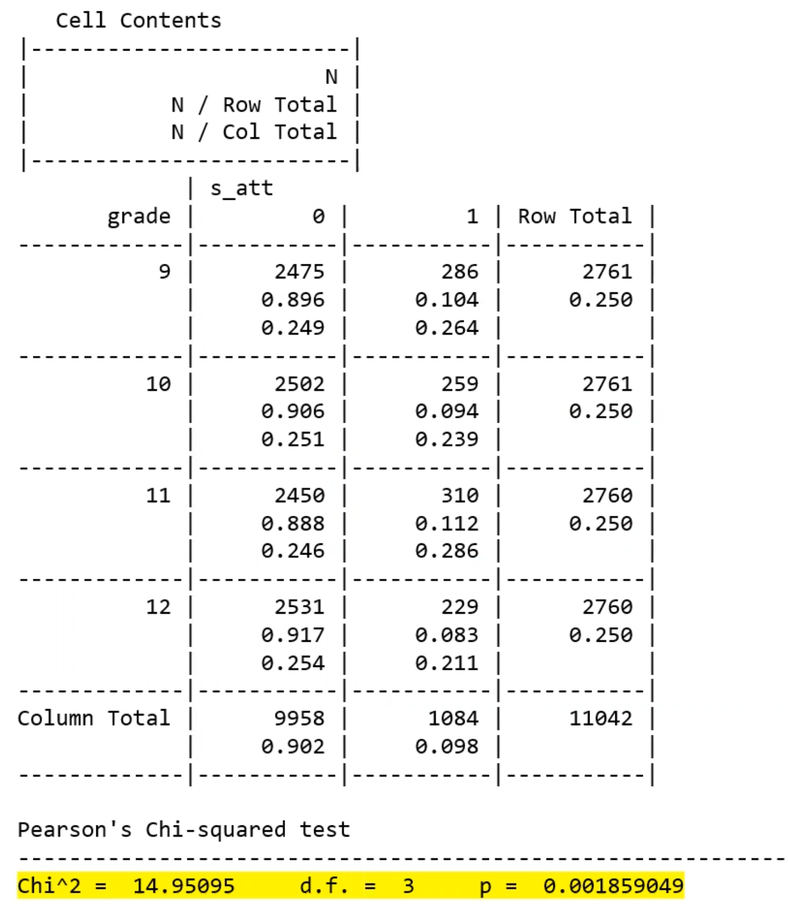

# Week 10 - Prediction Models

# Introduction to Prediction Models

Two ways to approach development of regression models:

1. Testing a hypothesized association
- “Does a violence prevention program in high schools successfully reduce the chance that students will experience bullying?”
- Must consider potential confounders and effect modifiers
1. Developing a prediction model
- “What are the factors that contribute to developing coronary heart disease?”
- Confounders aren’t of interest, as there is no specific association we are examining
- We just want a model that has a successful prediction rate

Regression is just one tool used for prediction models (we discuss only logistic regression in this course)

- linear regression, logistic regression, time series, decision tree, neural networks, random forests

The model determine how the variables, as a set, predict the outcome.

What independent variables should be considered?

- anything that might help predict the outcome
- many independent variables can be included
- the variables don’t have to be etiologically relevant
- it is not necessary to consider confounding

How many variables should be in the final model?

- enough to predict the outcome well, but not overfit the model
- rule of thumb: there should be at least 10 of each outcome (Y=0 & Y=1) for each predictor in the model (so beta and SE estimates are well-powered and not biased)

Parsimony

- every model is a simplification of reality (parsimony)
- if two models fit data equally well, the more parsimonious model is the one with fewer predictors
- models that are very complex may “over-fit” the data; providing very good prediction for our current sample but may not be generalizable to other sample (lacks external validity)
- models that are very complex are difficult to interpret

Validation

- to ensure the model isn’t over-fit to the data, development of a prediction model is usually done in two steps:
    1. Develop a model with a training set
    2. Validate the model with a testing data set
- training and testing sets should be independent (i.e., don’t validate on the training data)
- the validation component will provide evidence for external validity
- if you split a larger dataset into two sets for this purpose, generally 70% (up to 80%) of the data is used for training

# Steps in Prediction Model Building

Overview

1. Univariate analysis
2. Variable selection for multivariate model
3. Preliminary main effects model (does each variable retain significance?)
4. Main effects model (check linearity, scale of variables)
5. Preliminary final model (check for interactions)
6. Final model (check model fit and adequacy)
- prediction models are only as good as the variables you put into it — check your variables and data before beginning regression modeling

**Example**

Schools in rural areas face increased risk of mental health issues. Researchers want to determine whether characteristics of students’ friendship networks, in addition to demographic variables, can be used to identify students at risk of suicide attempt.

Variables used:

- male — male gender
- age — student age
- grade — student grade in school (9-12)
- odg — out-degree (# of friends named)
- dens — density of the ego’s friendship network (range from 0 to 1)
- recip — reciprocity of friendship nominations (range from 0 to 1)
- tatot — number of trusted adults named by the student (0-7)
- bullied — student was bullied at school
- bully — student bullied others at school

1. Determine the Form of the Outcome
- For a binary outcome, you may use:
    - Logistic regression
    - Probit regression (not covered in this course)
- For a non-binary outcome, you may use:
    - Linear regression
    - Poisson regression
    - Others
- For continuous/non-binary outcomes, it helps to evaluate any potential transformations with the entire set of possible X variables
1. Univariate Analyses
- Categorical predictors
    - Examine distribution of X for Y=0 and Y=1
    - Get univariate odds ratios
    - Pay attention to empty (zero) cells — we will need to deal with these somehow
        - The chi-squared test from the contingency table is asymptotically equivalent to the LR chi-squared test from the logistic regression model
- Continuous predictors
    - Examine the distribution of X for Y=0 and Y=1
    - Get univariate odds ratios
    - Assess the linearity assumption (grouped smooth, LOESS, fractional polynomials)
        - The 2-sample t-test is asymptotically equivalent to the chi-squared tests from the logistic regression model
- Example: relationship between grade and attempt: contingency table
    - the relationship between grade and attempt is significant

```r
with(sos_dat, gmodels::CrossTable(grade, s_att, prop.chisq=F, prop.t=F, chisq=T))
```



```r
# can also look at significance of variables with logistic regression

glm(s_att ~ factor(grade), family = binomial, data = sos_dat)

# look at the p-values for beta estimates
```

```r
# also should look at group smooth approach to see if we want a linear association or to keep grade as dummy variables

group_smooth("grade", "s_att", sos_dat)

# the significant p-value says that dummy variable approach fits the data better
```

- Example: relationship of out-degree by attempt status

```r
sos_dat %>%
	group_by(s_att) %>%
	select(s_att, odg) %>%
	skimr::skim()

# can see that those with attempt have lower mean named friends
```

- look at out degree by loess and grouped smooth plot:


- one more approach: fractional polynomials

```r
mfp(s_att, ~fp(odg), family = binomial, data = sos_dat)
```

1. Variable Selection
- after all variables have been examined univariately, include:
    - all variables with “clinical importance”
    - if this produces too many variables, include all with a univariate p < .25
        - a less strict p-value is used to include significant variables as they may become more significant later (i.e. in combination with others)
    - constrain the total number of variables to follow the sample size rule of thumb, either by redefining the definition of “clinically important” or by choosing a lower p-value threshold for inclusion
1. Preliminary Modeling
- use purposeful model building to examine several different models
    - be careful of automated selection procedures (stepwise regression)
    - forward selection produces more “noise” variables
    - some good models cannot be found with automated selection
    - in general, automated procedures do not do well with correlated predictors
    - automated selection discourages thinking about the actual problem
    - automated procedures can be helpful for hypothesis-generating analyses (after the primary analysis is done)
- be skeptical of p-values
    - p-values are only valid for testing pre-specified hypotheses
    - since we are screening variables, p-values only indicate relative importance among all variables included
    - the larger the candidate pool of variables, the more variables appear significant when they in fact aren’t related to outcome
- scrutinize the models for biological plausibility
- choose the “best” multivariate model
- Verify Each Variable
    - verify, delete, refit, etc. until you’re satisfied that:
        - all important variables are included in the model
        - all excluded variables are clinically or statistically unimportant
    - then you will have the ********preliminary main effects model********
- Example preliminary main effects model include:
    - odg, dens, recip, male, bully
    - why did age and grade drop out of the model?
        - maybe as students spend more time in school, out degree, reciprocity, density all increase so including them in the model may cause age and grade to not be significant
        - bully and bullied may be correlated
1. Refine your model
- re-assess linearity for continuous variables
    - this assumption is usually not critical in the variable selection stages: the model-building process is quite forgiving for modest violations of linearity (except for U-shaped relationships)
    - scatterplots (e.g., LOESS) are not easily extended to multivariable models
    - grouped-smooth and fractional polynomials are good approaches to assess linearity in multivariable models
- make sure your model makes sense clinically and scientifically
- you now have the ************************************main effects model************************************
1. Check for interactions
- list all pairs of variables that have scientific plausibility for interaction and add them to the model
    - may need to discuss “plausibility” with you co-investigators with content expertise
    - add one at a time to the main effects model
    - include interactions significant at p<.05 (we are stricter here because non-significant interactions tend to inflate the standard errors of beta coefficients)
- you now have the **preliminary final model**
    - what does it mean for an out-degree x density interaction?
        - means that density is more protective ($\beta_{odg *dense}$=-0.48) of your risk of suicide attempt when you name more people as your friend
1. Check Model Fit
- fit statistics
    - Pearson’s GOF
    - Hosmer-Lemeshow
- model diagnostics
    - closely examine influential points
    - do NOT exclude influential points simply to get better fit
    - consult with investigators and content experts to see if there is a reason why points might be excluded
- you now have the **********************final model**********************

# Predictive Power

- recall that logistic regression provides logit values, which are converted to $\hat{\pi}$, the estimated probability that Y = 1
    - the data has some underlying probability of outcome but we can only observe 0 or 1
- generally, outcome status is classified by:
1. fitting the logistic model
2. obtaining the predicted probabilities for each subject ($\hat{\pi}$)
3. choosing a cut-point $c$ (usually c=0.5)
4. classifying individuals into an estimated outcome based on their predicted probability and $c$, such that:
    1. If $\hat{\pi}> c, \hat{Y} = 1$
    2. If $\hat{\pi} < c, \hat{Y} = 0$

- to get model results:

```r
DescTools::Conf(best_model, pos = 1)
```

- this will give you confusion matrix, accuracy, etc.
- the model above achieved 90% accuracy — however an issue with this is that a high accuracy can be achieved if the model predicted all 0 for an outcome with low probability
    - the `No Information Rate` information gives the accuracy achieved if everyone was predicted to have the more likely outcome
    - `P-Value [Acc > NIR]` gives the p-value for the statistical test that the accuracy is ******better****** than the no information rate
- a total of 1049 + 35 = 1084 individuals who had Y = 1. However, the model only predicted 16 + 35 = 51 to have the outcome. It seems that the model was conservative in assigning Y = 1.
- **Sensitivity**: proportion of individuals that had the outcome (Y = 1) that also had the predicted outcome ($\hat{Y}$=1)
    - how good the model is at identifying individuals that had the outcome, or if you had the outcome what is the probability the model said you had the outcome
- **Specificity**: proportion of individuals that did not have the outcome (Y = 0) and were also predicted to not have the outcome ($\hat{Y}$ = 0)
- **Positive Predictive Value**: the proportion of those predicted to have the outcome that actually did have the outcome (Y=1)
    - what is the probability they actually had the outcome given they were predicted to have the outcome
- **********Negative Predictive Value**********: the proportion of those predicted to not have the outcome that actually did not have the outcome (Y=0)
    - what is the probability they did not have the outcome given they were predicted to not have the outcome
- these metrics depend on the relative sizes of each group (Y=1, Y=0)
    - typically more likely that individuals are classified into whatever outcome is more prominent
    - this likelihood increases as the relative size oof the larger group increases
- by looking at the distribution of predicted probabilities ($\hat{\pi}$), almost nobody had a predicted probability of over 0.5
- classification also depends on how similar individuals in the population are (with respect to $\hat{\pi}_i$):
    - in a ********************homogenous******************** population, many individuals will have $\hat{\pi}_i$ close to the classification threshold, which can be problematic as observations with similar $\hat{\pi}_i$ are forced into discrete outcome categories
        - e.g. subject with $\hat{\pi}_i =0.495$ will be classified as no-outcome and subject with $\hat{\pi}_i =0.505$ will be classified as having outcome; even though the probabilities are very close to each other
    - in a **************************polarized************************** population, the $\hat{\pi}_i$ are distributed at the extremes
    - in both of the above cases, we shouldn’t expect perfect fit
        - if most individuals have $\hat{\pi}_i$  close to 0.5, then we should expect about 50% misclassification
        - if most individuals have $\hat{\pi}_i$ close to 0.05 or 0.95, then we should expect about 5% misclassification
        - classification measures (e.g. sensitivity and specificity) depend on the distribution of $\hat{\pi}_i$ in the sample and, therefore are not absolute measures of goodness of classification
    - we can **************************************change the cut-point************************************** to make it easier or harder to classify Y = 1
        - this should be done depending on the research question

Example

- we want to use this diagnostic tool in order to help identify students at school who may be particularly at-risk for suicide attempt
- we will use the tool to discretely contact students and refer them to resources at school that can help them
- in this case, we may want to *lower* the cut-point
    - this will be able to detect more students with attempt, at the cost of classifying some without attempt as having it
- when you lower the cut-point:
    - sensitivity $\text{P}(\hat{Y}=1|Y=1)$ ******************increases******************
    - specificity $\text{P}(\hat{Y}=0|Y=0)$ ******************decreases******************
- when you raise the cut-point
    - sensitivity decreases
    - specificity increases

Sensitivity vs Specificity — Advantages

- sensitive models are helpful in identifying those who actually have the disease, even at the cost of misdiagnosing some individuals without the disease
    - screening tests with the opportunity for further follow-up
    - examples: mammograms, HIV screening, airport security
- specific models should be used when we want to verify that an individual does not have the disease, even at the cost of misdiagnosing some individuals who actually have the disease
    - useful after preliminary screening when being diagnosed “positive” has large risk of physical, emotional, or monetary harm (e.g. biopsies)

Predictive Value

- sensitivity and specificity are more useful for clinicians & researchers, when considering diagnosing individuals at the population-level
- PPV and NPV are more useful to the patient

Changing the cut-point

- you can make a plot of the accuracy over all possible cut-points
- in the example, the accuracy doesn’t seem to be able to improve much from the original cut-point

# Optimizing Classification

- there is a tradeoff between sensitivity and specificity, which can be visualized

```r
tibble(
	Cutoff = measure$Cutoff,
	SENS = measure$SENS,
	SPEC = measure$SPEC,
	SUM = SENS + SPEC,
) %>%
	arrange(-SUM, -SENS, -SPEC)
```

ROC (receiver operating characteristic) curves 

- another tool used to optimize classification, and provide a more complete assessment of classification accuracy
    - the area under these curves is indicative of how good a model fits

Example:

- BNP is a cardiac peptide secreted in the heart in response to volume expansion. Therefore, BNP levels can be used to detect cardiac problems. Furthermore, patients presenting with dyspnea (difficulty breathing) may be experiencing this symptom due to congestive heart failure.
- BNP is a diagnostic tool for congestive heart failure.
- the ROC curve plots sensitivity vs 1-specificity
- a better curve with steep slope at low x-axis values signifies that you can get good gains in sensitivity without sacrificing specificity
- and a flat slope at high x-axis values signifies you can get good gain in specificity without sacrificing sensitivity
- cutoff can be chosen at a point on the ROC curve that maximizes sensitivity and specificity

General guideline for an instrument’s discriminative ability

| AUC | Classification |
| --- | --- |
| 0.5 | Useless (essentially a coin flip) |
| 0.5-0.7 | Poor |
| 0.7-0.8 | Acceptable-Good |
| 0.8-0.9 | Excellent |
| 0.9-1.0 | Nearly Perfect |
- for things like a behavioral diagnosis, above 0.9 would be very rare
- but for things like a COVID test, you would want an AUC that is very high

- another way to assess the optimal cut-point:

```r
optimal.cutpoints(X = "score", status = "class",
	data = data.frame(model_output),
	methods = c("Youden", "MaxSpSe", "MaxProdSpSe",
	tag.healthy = 0)
```

- `Youden` = max(Sp + Se - 1)
- `MaxSpSe` = max(min(Sp, Se))
- `MaxProdSpSe` = max(Sp * Se)
