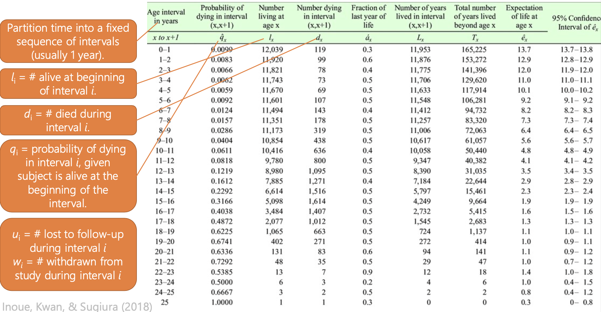
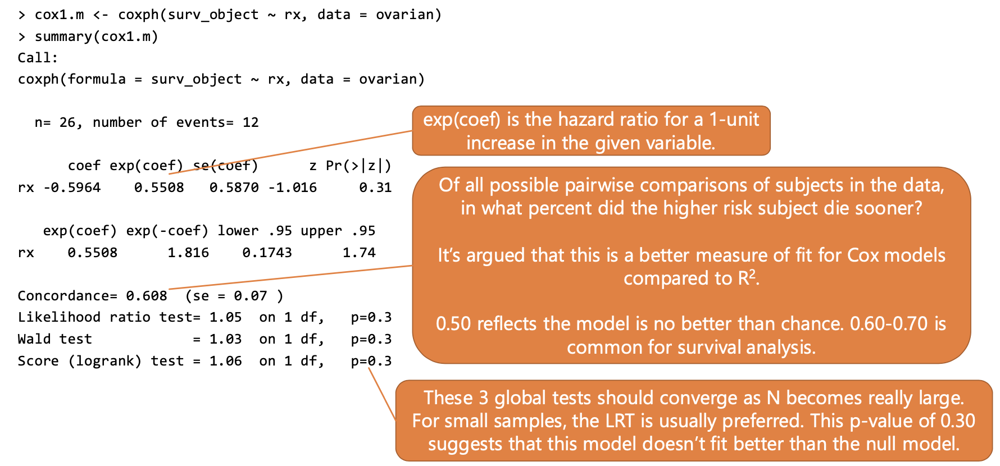

# Week 12 - Survival Analysis

# Introduction to Survival Analysis

************************Cohort Studies************************ are a type of study in which:

1. We identify an “exposed” group (v.s. an “unexposed” group)
2. We follow these individuals forward in time to determine outcome (disease, mortality, etc.)

For example:

- comparing mortality due to COVID-19 during hospital stay for white vs. nonwhite patients
- comparing mortality for individuals who received a new type of surgery vs. traditional surgery
- comparing HIV rates for individuals pre-exposure prophylaxis vs. control

****Prospective cohort****: identify a cohort without disease and follow the cohort forward in time

**********Retrospective cohort:********** identify the outcome status and then retrospectively assemble the cohort; typically done based on medical records, union records, etc.

Example:

- 26 women enrolled in a study comparing two different treatments for ovarian cancer
    - followed in time until something happened (censored or mortality)
    - censoring indicates leaving of the study for some reason but while under observation, did not get the outcome of interest
- advantages:
    - can estimate disease rates for exposed vs. unexposed
    - the observation time is taken into account (number diseased / number person-years at risk)
    - can define multiple outcomes of interest (e.g. mortality, other cancer type, other comorbidities)

Survival Functions of Time

Let the random variable T represent the time to event. We can describe the distribution of T with some important functions.

1. Survival Function. The probability that an individual survives past time t.

$$
\text{S(t) = P(T > t) =} \text{cumulative survival probability}
$$

$$
\text{S(0) = 1, } \text{S(}\infty\text{) = 0}
$$

$$
\text{F(t) = 1 - S(t) = P(T}\le\text{t)} = \text{cumulative disease/event probability}
$$

- cumulative survival probability will never increase over time, cumulative event probability will never decrease over time
1. Probability density. The probability the individual fails at time t

$$
\text{f(t) = P(subject fails at time t)}
$$

When time is measured continuously, the survival function can be expressed as:

$$
\text{S(t)} = \text{P(T > t)} = \int_t^\infty{f(u)du}
$$

, thus: $\text{f(t)} = -\frac{dS(t)}{dt}$

- the cumulative survival beyond t is equal to the integral of the PDF of the failure beyond t
- the probability an individual fails at time t is inversely related to the instantaneous change in their probability of surviving past time t

When time is measured in intervals, the survival function can be expressed as:

$$
\text{S(t)} = \text{P(T > t)} = \sum_{i_{j}>p}p(t_j) \text{where} p(t_j) = \text{P(T =}t_j\text{)}
$$

- P is the probability an event occurs in interval $t_j$
1. Hazard Rate. The probability an individual who is free of disease at time t has the event in the next instant of time

$$
\lambda(t) = \lim_{dt \to 0}\frac{P(t \le T \lt t+dt | T \ge t)}{dt}
$$

$$
\lambda(t) \ge 0
$$

- (probability the subject fails in the next instant given they don’t have the disease at time t)

When time is measured continuously, the hazard rate can be expressed as:

$$
\lambda(t) = \frac{f(t)}{S(t)} = -d\frac{\ln{(S(t))}}{dt}
$$

- probability the subject fails at time t, divided by the probability the subject survives past time t

From this we can compute:

$$
f(t) = \lambda(t)S(t)
$$

- the probability of having an event in (t, t+dt) equals the probability of surviving to the beginning of that time period, times the conditional probability of failing in that time period

If we integrate the hazard function over time, we can get the **cumulative hazard function**:

$$
\Lambda(t)=\int_0^t\lambda(u)du=-\ln(S(t))
$$

$$
S(t)=e^{-\Lambda(t)}=e^{-\int_0^t\lambda(u)du}
$$

# Kaplan-Meier Tables

The simplest way of observing mortality over time is a cohort or generation lifetable.

- uses mortality rates from a particular birth (or other) cohort
- observe the mortality of all persons from $t_0$ until all persons die (or are lost to follow-up)
- answers epidemiologic questions regarding some outcome:
    - for acute disease, the case fatality rate can be a useful measure of survival
    - for chronic disease (diseases that take longer to see an effect such as hypertension), the case fatality rate is not a useful measure. A lifetable can provide specific information about the probability of surviving/dying within a time period after diagnosis

Example of a Kaplan-Meier Table



The probability of surviving through each interval *i* is given as $p_i=1-q_i.$

$P_i$ is the cumulative probability of surviving to interval $i$, and is computed as $P_i= \Pi_1^ip_i$

- (the product of the probability of surviving at each interval before time **i**)

A Kaplain-Meier Table is similar to a lifetable, but:

- each interval is constructed whenever an individual fails
- each interval should have only one failure (time) event
- the number of intervals equals the number of unique failure times
- $q_i=d_i/l_i$
    - probability of failing at interval **i** is equal to the number of subject that died at interval *i* divided by the length of that interval
        - intervals here may have different lengths

$\hat{P_k}$ is the cumulative survival probability (the product-life estimate), and reflects the probability of surviving from the start of interval 1 until the end of interval k

$$
\hat{P_k} = \hat{S}(k)=\Pi_{i=1}^k\hat{p_i}=\Pi_{i=1}^k\frac{l_i-d_i}{l_i}
$$

Use `Surv` function to create a survival object in R

```r
surv_object <- Surv(time = ovarian$futime, event = ovarian$fustat)
```

- time = follow-up time, and event = follow-up status (1 = died, 0 = censored)

Construct the Kaplan-Meier Table:

```r
survfit(formula = surv_object ~ 1, data = ovarian) %>% summary()
```

- `n` = number of individuals in the data set
- `events` = number of individuals that died
- `median` = time when 50% of individuals died

The variance of the survival probability is obtained using **************************Greenwood’s Variance Formula**************************

- the square root of this variance is often presented as the standard errors on statistical output, but are NOT used in computing the confidence intervals of the survival probability
- the CI is created by computing a 95% CI on $\ln(-\ln(S_k))$, and then back-transforming
    - complicated calculation, class will not require this

Adding a Predictor to the Model

```r
surv2.m <- survfit(surv_object ~ rx, data = ovarian)
summary(surv2.m)
```

It is much easier to visualize the curves:

```r
ggsurvplot(surv1.m, data = ovarian, surv.median.line = "hv")
```

- “+” indicates a censored observation
- median survival time is where the Kaplan-Meier curve crosses 50% survival probability
    - similarly, the 95% CI of the median survival time is when the lower CI crosses 50% survival probability

How to compare whether two survival curves are the same statistically

1. **Log-Rank Test** 
- $H_0:\lambda(t)=\lambda_2(t)=\lambda_3(t)=...\:\text{for groups 1, 2, 3, etc.}$
    - the hazard function for stratum 1 is the same for stratum 2, 3, etc.
    - alternative hypothesis is that they are different
- each failure time contributes to the test statistic
- treats the hazard function as proportional across groups over follow-up time

$$
\chi^2_{I-1}=\sum_i\frac{(D_i-E_i)^2}{E_i}
$$

- chi-square test with I-1 degrees of freedom
- where I = # groups
- $D_i$ = total observed failures in group $i$ (summed over all failure times)
- $E_i$  = expected failures in group $i$ (summed over all failure times)
- under $H_0$, the expected failures in group $i$ at time $j = e_{ij}-\frac{l_{ij}d_j}{l_j}$
- essentially comes down to how many failures observed vs how many failures expected

```r
survdiff(surv_object ~ rx, data = ovarian)

# plot survival curves with p-value
ggsurvplot(surv2.m, data = ovarian, pval = T)
```

1. **********************Wilcoxon Test**********************
- use when hazards between groups may not differ proportionally across follow-up
- this method weights each failure time contribution by the number of subjects at-risk at that time, giving greater weight to earlier events when more subjects are at risk
- this test is sensitive to different censoring patterns among groups
    - if one group is heavily censored early on, this test may not perform that well
- other tests can be implemented using differing values of rho in the `survdiff()` function — all comes down to how you weight the test

Recap

- Lifetables and Kaplan-Meier tables are ways of summarizing information about the number of subjects with an observed event at different times across follow-up
- Kaplan-Meier curves can be used to visualize the number of subjects experiencing the event
- The log-rank test is perhaps the most common statistical test for comparing Kaplan-Meier curves, but it assumes the hazard is proportional among exposure groups

# Cox Proportional Hazards Model

**Analyzing event data**

- When we have time-to-event data, each individual is followed for a certain amount of time and their outcome status is ascertained
- If we want to perform more sophisticated regression approaches, we can do the following:

| Method | Approach | Advantages | Disadvantages |
| --- | --- | --- | --- |
| Logistic Regression | Model risk of outcome within the specified time frame | construct a model with an approach we know | follow-up times and vary, difficult to deal with loss to follow-up, difficult to deal with exposures that may vary across time |
| Survival Regression | Model hazard rate (lambda) as a function of time and explanatory exposures | deal with censored data, competing causes, and time-dependent exposures | must choose the correct model, must be familiar with model assumptions |

**********************************Modeling Strategy for Cox Proportional Hazards Model**********************************

- assume a background rate $\lambda_0(t)$ which represents the disease rate when all X = 0
- model exposures x(t) as they modify the background disease rates (perhaps they are higher in exposed individuals, for example)
    - we are interested in looking at how our covariates *****shift***** the hazard across time
- estimate regressioin parameters $\beta$ in the presence of nuisance parameters ($\lambda_0(t)$)

The most common proportional hazards model is Cox Proportional Hazards Regressionn

- in this model, we express the individual hazard rate as a function of some baseline hazard rate that is modified by the measured covariates

$$
\lambda(t_i,x_i)=\lambda_0(t_i,\alpha)e^{\beta'x_i}
$$

- the underlying hazard function: $\lambda_0(t_i,\alpha)$
- the effect of covariates: $e^{\beta'x_i}$
- therefore, the hazard rate ratio $\frac{\lambda(t_i,x_i)}{\lambda_0(t_i,\alpha)} = e^{\beta'x_i}$. That is, we restrict the hazard functions to be proportional with respect to the covariates

Look at the effect of treatment (rx) on survival

```r
cox1.m <- coxph(surv_object ~ rx, data = ovarian) %>% summary()
```



- $\frac{\lambda(t_1,\text{rx}=2)}{\lambda_0(t_1,\text{rx}=1)} = e^{\beta_{\text{rx}}}$
- “a 1-unit increase in treatment group is associated with 0.55 times the hazard of death, the effect is not statistically significant p=0.3)”

```r
# plot predicted hazard curves
ggadjustedcurves(cox1.m, data = ovarian, variable = "rx")
```

- the two curves will be constrained to be proportional because of the modeling approach
- these are not the actual hazard curves, these are the hazard curves based on the Cox PH model
    - shows what the curves would look like if our model was indeed true

Recap

- the Cox-PH model assumes a baseline hazard rate, and exposure covariates change this hazard rate
- one large assumption is that covariates affect the hazard rate proportionally across time
    - if they don’t the model isn’t valid

# Cox PH Model: Assumptions and Diagnostics

****Assumptions of the Cox PH model****

1. the covariates are linearly related to the log hazard of outcome
2. changes in covariates contribute to a proportional change in the hazard function across all time points
    - want to see that the effect of covariates is the same on these proportional hazards across time

**Examining the Linearity Assumption**

To examine linearity of our covariates with the log hazard, we can use:

1. approaches we currently know, such as grouped smooth or fractional polynomials
2. the Martingale residuals; the difference between the observed and model-predicted number of failures, for each individual

Fractional Polynomials

```r
mfp(Surv(futime, fustat) ~ fp(age) + rx, family = cox, data = ovarian)
```

- since `rx` is binary, we don’t need to consider its functional form

Martingale Residuals

- the predicted number of failures for subject ****i**** at the end of follow-up time $T_i$ is computed from the fitted model as:

$$
\hat{\Lambda}(T_i) = \hat{\Lambda}_0(T_i)e^{\beta'x}
$$

- the martingale residual is calculated as:

$$
r_{m_i} = \delta_i=\hat{\Lambda}(T_i)
$$

- where $\delta_i$ is the subject’s failure status
- Martingale residuals have a mean 0 with range $-\infty$, 1
- it may seem counterintuitive since we expect a subject would only fail once, but the model can actually predict people can fail more than once if followed for long enough
- the Martingale residual should be linearly related to f(x), the optimal transformation of x
- these aren’t the usual type of residuals; there’s no clear analogy between these residuals and those in linear regression
- think of these residuals generally as being some measure of difference in observed vs. predicted values
- “Observed Y” doesn’t make sense in survival time data, as survival is defined as presence of the event (Y=1 or Y=0) ***and*** the time at which the event occurred
- A value of “1” indicates the person had the event but had a very small cumulative hazard
- A large negative residual indicates the person was censored (survived) but had a very large cumulative hazard

****************Approach****************

- run the Cox model with no covariates (null model)
- generate Martingale residuals
- plot the residuals against the values of the covariates under consideration
- inspect the LOWESS line for a linear relationship

```r
# looking at different forms of age vs the residuals

ggcoxfunctional(surv_object ~ age + log(age) + I(age^2), data = ovarian)
```

- looking for continuous covariate is linearly related to the Martingale residuals

**Examining the Proportional Hazards Assumption**

Can use the Schoenfeld residuals. The Schoenfeld residual for variable x  in subject *i* is calculated as:

$$
r_s = D_i(x_i-\alpha_i)
$$

- , where $D_i=1$ when there is an event
- The difference between the observed $x_i$ for the subject who had the event and the weighted average of all $x_i$ for all subjects in the risk set when the subject had the event
    - e.g. if someone is diagnosed with COVID, we look at the age of the person diagnosed, and look at the average age for everyone in the risk set and the residual = the difference between the two

The scaled Schoenfeld residual is calculated as:

$$
\hat{\beta}+dVar(\hat{beta})r_s
$$

- where d = the total number of failure events

To test the PH assumption, we look at how the Schoenfeld residuals change over time — maybe older people are more likely to get the event earlier on

- we do not want the effect of a covariate to depend on time (want it to be constant across all time)

```r
cov.zph(cox2.m) # want to see p-vals not significant

ggcoxzph(cox.zph(cox2.m)) # want to see horizontal lines across time
```

What happens if PH assumption is not met?

- add an interaction of the particular covariate with time and re-address
- stratify the hazard function by the problematic covariate

******Model Fit******

- to examine model fit, including influential observations or outliers, we can use:
    - Cox-Snell residuals
    - deviance residuals
    - DFBETA values

Cox-Snell residuals

- From before:

$$
r_{m_i} = \delta_i - \hat{\Lambda}(T_i)
$$

- The Martingale residual is the event status minus the Cox-Snell residual. Therefore:

$$
r_{cs_i} = \delta_i-r_{m_i}
$$

- we use these residuals as pseudo observation times to fit a null Cox model, then obtain the Nelson-Aalen cumulative hazard estimator
- The model fits well when:
    - The CS residuals are distributed as exponential with a constant hazard rate $\lambda$ = 1 over time
    - Their cumulative hazard will follow a 45-degress line (slope of 1)

```r
coxph(
	Surv(ovarian$fustat - residuals(cox2.m, type = "martingale"), fustat)
	data = ovarian) %>%
	basehaz() %>%
	ggplot(aes(x = time, y = hazard)) +
	geom_point() +
	geom_smooth() +
	geom_abline(slope = 1, intercept = 0, color = "red")
```

- a violation of this pattern could indicate that proportional hazards isn’t met, that there are outliers, and/or that the functional form of the model isn’t specified correctly

Deviance Residuals

- recall, this is change in model deviance when each subject is removed
- they should be normally distributed around 0 with a standard deviation of 1

$\Delta\beta$ (Dbeta)

- represents amount that each observation changes the parameter estimates

Recap

- Cox PH regression introduces metrics such as Martingale residuals, Schoenfeld residuals, and Cox-Snell residuals
- We can still use deviance residuals and dbeta values to examine influential observations

# Stratified Cox Regression

Normally, we assume one underlying baseline hazard function for all individuals. However, we can assume different baseline hazard functions across *k* strata of the adjustment variable:

$$
\lambda_k(t, x) = \lambda_{0k}(t)e^{\beta'x}
$$

- this approach is useful because baseline hazards may differ greatly by some covariate, such as age or gender
- therefore we adjust for the covariate of interest, but we are not able to examine the effect of that covariate on hazard
    - we never interpret the hazard function, we only interpret the effect of the covariates

```r
# adding 2 variables to survival analysis:
# r_disease: is residual disease present? (0 = no, 1 = yes)
# ecog_good: ECOG performance (1 = good, 0 = bad)

coxph(formula = surv_object ~ rx + age + ecog_good + r_disease, data = ovarian)

# year increase in age is associated with 1.13 (exp(coef)) times the hazard of death
```

- keep in mind that the predicted survival curves will be proportional to each other because they were modeled to have proportional hazards
- the general shape of the curve is given by the baseline survival function ($\lambda_0(t)$)
    - the covariates proportionally modify that curve

```math
\lambda(t, x) = \lambda_0(t)e^{\beta_1X_{\text{RX}}+\beta_2X_{\text{AGE}}+\beta_3X_{\text{ECOG\_GOOD}}+\beta_4X_{\text{R\_DISEASE}}}
```

- if for example, there is a violation of proportional hazards with the ECOG variable, we can create a different baseline hazard function for each stratum of ECOG

```r
coxph(surv_object ~ rx + age + r_disease + strata(ecog_good), data = ovarian)
```

```math
\lambda(t, x) = \lambda_{0,i}(t)e^{\beta_1X_{\text{RX}}+\beta_2X_{\text{AGE}}+\beta_4X_{\text{R\_DISEASE}}}
```

- i=1, ecog good; i= 0, ecog bad
- now, the baseline hazard curves for each stratum of `ecog_good` are not constrained to being proportional

**Summary**

- survival analysis incorporates information about presence of outcome (e.g. death) and time to outcome, while accounting for the possibility of loss to follow-up
- Kaplan-Meier curves show the expected survival by time, and can be statistically compared among strata of a categorical predictor variable
- The Cox Proportional Hazards model assumes a baseline hazard function $\lambda_0(t)$, and covariates proportionally impact that hazard
- The proportional hazards assumption must be met; if it is not, then you can include a time interaction or use a different baseline hazard function within each stratum of that variable
